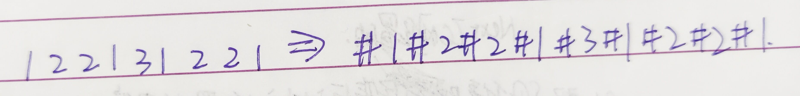
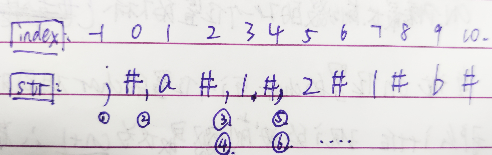
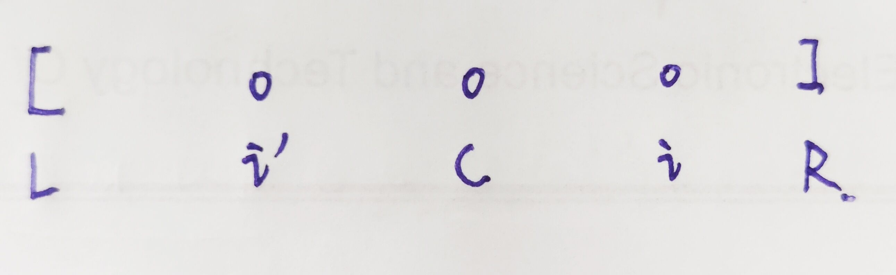

### `Manacher`

> 解决最长回文串问题

#### 找出最长回文串的长度

1. **问题描述**

   给定一个字符串，返回该字符串中最长的回文串的长度

2. **传统方法**

   从字符串的第一个位置开始遍历，对每个字符开始，以它为中心向两边扩展，找最长的回文串长度。

   > 但是这种方法只能处理奇数个长度的问题，偶数个长度例如`abba`就无法处理。

3. **解决方法**

   

   然后长度除以2即可

   > 这里无所谓后添加的字符是不是原串中存在的字符。假设添加的字符为虚，原来的字符为实，那么永远都是虚跟虚比，实跟实比，不存在实跟虚比的情况。

   > 时间复杂度为O(N^2)，例如：`#1#1#1#1#1#1#1#`

#### `Manacher`算法

* **前提概念**

  

  1. 回文半径：4

  2. 回文直径：7

  3. 最右边界R

     

     初始值为-1，第二次为井号右边，圈住0位置，为0，依次类推，取最右边的值。

     > 更新R的时候，也要更新当前回文串的中心位置C

  4. 中心位置C

     在更新最右位置R的时候，顺便要更新回文串的中心位置C

* **流程**

  1. 当前遍历的位置 i 不在R里面，则暴力扩。更新R

  2. 当前遍历的 i 在R里面，那么一定存在这样的拓扑结构

     

     > 途中 L 与 i ' 是 R 与 i 的对称点。

     * 若 i’ 的回文区域在LR里面，那么 i 的回文区域就和 i‘ 一样的
     * 若 i’ 的回文区域有一部分在LR外面，那么 i 的回文半径就是 i ~ R
     * 若 i‘ 的回文半径和 L 重合，那么从 i ~ R 就不用看了，一定是回文半径。然后再往下遍历查找。更新R   

  > 注意这里也要讲原字符串虚实结合