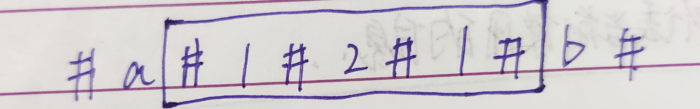

### `Manacher`

> 解决最长回文串问题

#### 找出最长回文串的长度

1. **问题描述**

   给定一个字符串，返回该字符串中最长的回文串的长度

2. **传统方法**

   从字符串的第一个位置开始遍历，对每个字符开始，以它为中心向两边扩展，找最长的回文串长度。

   > 但是这种方法只能处理奇数个长度的问题，偶数个长度例如`abba`就无法处理。

3. **解决方法**

   

   然后长度除以2即可

   > 这里无所谓后添加的字符是不是原串中存在的字符。假设添加的字符为虚，原来的字符为实，那么永远都是虚跟虚比，实跟实比，不存在实跟虚比的情况。

   > 时间复杂度为O(N^2)，例如：`#1#1#1#1#1#1#1#`

#### `Manacher`算法

* **前提概念**

  

  1. 回文半径：4

  2. 回文直径：7

  3. 最右边界R

     

     初始值为-1，第二次为井号右边，圈住0位置，为0，依次类推，取最右边的值。

     > 更新R的时候，也要更新当前回文串的中心位置C

  4. 中心位置C

     在更新最右位置R的时候，顺便要更新回文串的中心位置C

* **流程**

  1. 当前遍历的位置 i 不在R里面，则暴力扩。更新R

  2. 当前遍历的 i 在R里面，那么一定存在这样的拓扑结构

     

     > 途中 L 与 i ' 是 R 与 i 的对称点。

     * 若 i’ 的回文区域在LR里面，那么 i 的回文区域就和 i‘ 一样的
     * 若 i’ 的回文区域有一部分在LR外面，那么 i 的回文半径就是 i ~ R
     * 若 i‘ 的回文半径和 L 重合，那么从 i ~ R 就不用看了，一定是回文半径。然后再往下遍历查找。更新R   

  > 注意这里也要讲原字符串虚实结合

* **代码流程**

  * 首先将字符串虚实结合
  * 定义变量R C，当前查询位置 i，定义一个长度与虚实字符串长度相同的int数组，里面保存该位置的回文半径
  * 循环处理回文半径数组中的每个元素
  * 先确定好不用比较的回文半径，如果 i 在R的里面的话，那么回文半径就是：i’ 的回文半径与R - i 之间的最小值。如果  i 在R外面，那么不用比较的回文半径就是自己，即1
  * 确定完当前位置的回文半径后，判断一下是否需要更新C与R

* **代码实现**

  ```java
  	public static char[] getManacherString(String s) {
          char[] str = s.toCharArray();
          char[] res = new char[str.length * 2 + 1];
          for (int i = 0; i < res.length; i++) {
              res[i] = (i & 1) == 0 ? '#' : str[(i - 1) / 2];
          }
          return res;
      }
  
      public static int getMaxLength(String s) {
          if (s == null || s.length() == 0) {
              return 0;
          }
          char[] str = getManacherString(s);
          int[] pArr = new int[str.length];
          int R = -1;
          int C = -1;
          int max = 0;
          for (int i = 0; i < str.length; i++) {
              pArr[i] = i < R ? Math.min(pArr[2 * C - i], R - i) : 1;
              while (i + pArr[i] < str.length && i - pArr[i] > -1) {
                  if (str[i + pArr[i]] == str[i - pArr[i]]) {
                      pArr[i]++;
                  } else {
                      break;
                  }
              }
              if (i + pArr[i] > R) {
                  R = i + pArr[i];
                  C = i;
              }
              max = Math.max(max, pArr[i] - 1);
          }
          return max;
      }
  ```

#### 滑动窗口最大值

1. **问题描述**

   现有一个数组，上面有一个滑动窗口，窗口可以右边界移动，也可以左边界向右移动，但是左边界不能超过右边界，且不能向左移动。

2. **流程分析**

   设右边界为R，左边界为L，定义一个双向队列，左边为队头，右边为队尾，要求队列中从头到尾由大变小。

   * 当R向右移动时，就相当于滑动窗口中要加入一个元素，那么就准备从双向队列的队尾入队。
   * 检查该元素是否满足入队条件，即队尾的元素必须比它大，如果队尾元素比它小，那么把队尾元素从队尾出队，再重新比较队尾元素，直到队列为空，或者队尾元素大于它（注意不能是等于）
   * 当L向右移动时，就相当于有一个元素要被移出滑动窗口，只需检查当前移出的元素是不是队列中的最大元素，即头元素，若是则移出，否则不用管。

   > 因此，这个双向队列里只维护了滑动窗口这个范围中的最大值

   

#### 例题

1. **问题描述**

   给一整形数组和大小为 w 的窗口，该窗口从最左边滑动到最右边，每次滑动一个位置。每个位置的窗口中都有一个最大值，输出这些最大值组成的数组。

   

2. **代码流程**

   按章上面的思路，每次滑动窗口右边界移动一个，再左边界移动一个。然后取双向队列里面的第一个。

3. **代码实现**

   ```java
   	public static int[] getMaxWindow(int[] arr, int w) {
           if (arr == null || arr.length == 0 || w <= 1 || w > arr.length) {
               return arr;
           }
           int[] res = new int[arr.length - (w - 1)];
           LinkedList<Integer> list = new LinkedList<>();
           for (int i = 0; i < w; i++) {
               while (!list.isEmpty() && arr[list.peekLast()] <= arr[i]) {
                   list.pollLast();
               }
               list.addLast(i);
           }
           int index = 0;
           res[index] = arr[list.peekFirst()];
           //*
           for (int R = w, L = 0; R < arr.length; R++, L++) {
               while (!list.isEmpty() && arr[list.peekLast()] <= arr[R]) {
                   list.pollLast();
               }
               list.addLast(R);
               if (list.peekFirst() == L) {
                   list.pollFirst();
               }
               res[++index] = arr[list.peekFirst()];
           }
           return res;
       }
   ```

   > 注意：*这里L是要移出的元素，所以初始值为0，R是要加入的元素，所以初始值为w（数组下标）