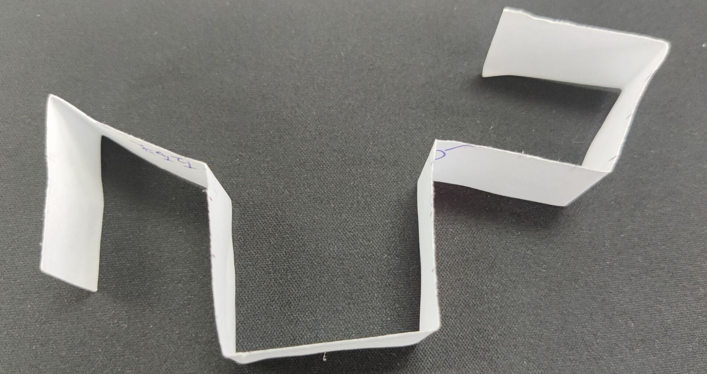

## 二叉树

> 假设我可以向我的子节点获取信息，该怎么解决这道题

> 递归：考虑基础代码，从左右子树获取信息，再综合左右树的信息做全集，处理自己的信息

* **遍历**

  1. 先序遍历

     > 先序遍历，就是深度优先遍历

     **递归**

     ```java
     	public static void preOrderIterate(TreeNode root) {
             if (root == null) {
                 return;
             }
             System.out.print(root.value + "\t");
             preOrderIterate(root.left);
             preOrderIterate(root.right);
         }
     ```

     **非递归**

     1. 从栈中弹出一个节点
     2. 打印或者处理cur
     3. 先压栈右节点，再压栈左节点（如果存在）
     4. 回到1

     ```java
     	public static void preOrderUnRecur(TreeNode root) {
             if (root == null) {
                 return;
             }
             Stack<TreeNode> stack = new Stack<>();
             stack.add(root);
             while (!stack.empty()) {
                 TreeNode node = stack.pop();
                 System.out.print(node.value + "\t");
                 if (node.right != null) {
                     stack.push(node.right);
                 }
                 if (node.left != null) {
                     stack.push(node.left);
                 }
             }
             System.out.println();
         }
     ```

     > 任何递归都可以变为非递归

  2. 中序遍历

     **递归**

     ```java
     	public static void inOrderIterate(TreeNode root) {
             if (root == null) {
                 return;
             }
             preOrderIterate(root.left);
             System.out.print(root.value + "\t");
             preOrderIterate(root.right);
         }
     ```

     **非递归**

     1. 将每棵子树的左边界进栈

     2. 依次弹出的过程中，每弹出一个，便打印，并对弹出节点的右树进行1操作，然后继续弹出

        

     ```java
     	public static void inOrderUnCur(TreeNode root) {
             if (root == null) {
                 return;
             }
             Stack<TreeNode> stack = new Stack<>();
             pushLeftInStack(root, stack);
             while (!stack.empty()) {
                 TreeNode node = stack.pop();
                 System.out.print(node.value + "\t");
                 if (node.right != null) {
                     pushLeftInStack(node.right, stack);
                 }
             }
             System.out.println();
         }
     
         private static void pushLeftInStack(TreeNode root, Stack<TreeNode> stack) {
             while (root != null) {
                 stack.push(root);
                 root = root.left;
             }
         }
     ```

     ***升级版***

     ```java
     	public static void inOrderUnCur(TreeNode root) {
             if (root == null) {
                 return;
             }
             Stack<TreeNode> stack = new Stack<>();
             while (root != null || !stack.empty()) {
                 if (root != null) {
                     stack.push(root);
                     root = root.left;
                 } else {
                     root = stack.pop();
                     System.out.print(root.value + "\t");
                     root = root.right;
                 }
             }
             System.out.println();
         }
     ```

     > 首先我们想把左边界全都入栈，所以会想到：如果root不为空，入栈，然后root变为左节点，所以while中的一个判断是root不为null。如果root为null的话，说明此时已经到左边的底了，此时循环体中判断出root为null，所以就该出栈然后把出栈节点的右节点这样做了。那么当栈为空的时候，就要结束了，所以while中的另一个判断是栈不为空。

  3. 后序遍历

     **递归**

     ```java
     	public static void posOrderIterate(TreeNode root) {
             if (root == null) {
                 return;
             }
             preOrderIterate(root.left);
             preOrderIterate(root.right);
             System.out.print(root.value + "\t");
         }
     ```

     **非递归**

     根节点先放入栈

     1. 弹出栈，元素为cur
     2. cur放入收集栈
     3. cur左压栈，再压右（存在的话）
     4. 回到第一步

     收集栈出栈，打印

     > 表面上的顺序是，头左右，因为左右孩子是放到栈里的，所以出来就是头右左。这些再放到收集栈里面，再倒序打印出来就是左右头

     ```java
     	public static void posOrderUnRecur(TreeNode root) {
             if (root == null) {
                 return;
             }
             Stack<TreeNode> s1 = new Stack<>();
             Stack<TreeNode> s2 = new Stack<>();
             s1.push(root);
             while (!s1.empty()) {
                 root = s1.pop();
                 s2.push(root);
                 if (root.left != null) {
                     s1.push(root.left);
                 }
                 if (root.right != null) {
                     s1.push(root.right);
                 }
             }
             while (!s2.empty()) {
                 System.out.print(s2.pop().value + "\t");
             }
             System.out.println();
         }
     ```

* **二叉树宽度优先遍历**

  1. **流程**

     使用队列，先放入头节点。弹出并打印，然后把弹出的这个节点的左右节点入队。再弹出节点，如此反复。

  2. **代码实现**

     ```java
     	private static void widthIterate(TreeNode root) {
             if (root == null) {
                 return;
             }
             Queue<TreeNode> queue = new LinkedList<>();
             queue.add(root);
             while (!queue.isEmpty()) {
                 root = queue.poll();
                 System.out.print("\t" + root.value);
                 if (root.left != null) {
                     queue.add(root.left);
                 }
                 if (root.right != null) {
                     queue.add(root.right);
                 }
             }
         }
     ```

     * **求一棵二叉树的最大宽度**

       *使用哈希表*

       1. **流程**

          **需要声明的变量**：

          * **队列**（按宽度优先遍历演变来的，所以是队列不是栈）

          * **哈希表**：key为TreeNode，value为该节点所在层数

            > ​	入队时更新哈希表，入队是通过父节点的左右索引入队的，层数比它大一，所以首先把头节点的信息放到哈希表里面，后面的都可以通过while循环，从头算出来。

          * **当前统计的层数的节点数**```curLeveNodes```：处理这个节点的时候，如果发现这个节点在哈希表里面的层数比当前层数大了，说明这层已经统计完毕，那么当前层数++

          * **最大值Max**：当层数++时，说明这一层已经统计完了，此时就要更新max的值了

       2. **代码实现**

          ```java
          	public static int getTreeMaxWidth(TreeNode root) {
                  if (root == null) {
                      return 0;
                  }
                  int max = 0;
                  LinkedList<TreeNode> queue = new LinkedList<>();
                  HashMap<TreeNode, Integer> map = new HashMap<>();
                  map.put(root, 1);
                  queue.add(root);
                  int curLevel = 1, curLevelNodes = 0;
                  while (!queue.isEmpty()) {
                      root = queue.poll();
                      int level = map.get(root);
                      if (level == curLevel) {
                          curLevelNodes++;
                      } else {
                          max = Math.max(max, curLevelNodes);
                          curLevel++;
                          curLevelNodes = 1;
                      }
                      if (root.left != null) {
                          queue.add(root.left);
                          map.put(root.left, level + 1);
                      }
                      if (root.right != null) {
                          queue.add(root.right);
                          map.put(root.right, level + 1);
                      }
                  }
                  return max;
              }
          ```

          > ​	注意在更新层数的时候，要把下一层的节点个数设置为1，因为你发现这个节点的层数比当前层数大的时候，就说明你已经发现一个节点了。

          > 看代码方式，读别人的代码不要强去理解，按照人家的变量，一步一步在纸上画出来，才能看懂

       *不使用哈希表*

       1. **声明的变量**

          * ```curEnd```：当前遍历节点所在这一层的最后一个节点。
          * ```nextEnd```：当前遍历节点所在这一层的下一层的最后一个节点
          * ```curLevelNodes```：当前遍历节点所在层，已经统计到的节点个数
          * ```max```：全局变量，层数++的时候，更新最大值

       2. **流程**

          * 初始化：```curEnd = root;	nextEnd = null;	curLevelNodes = 0;	max  = 0```，root进队

          * 出队后

            1. 判断左右孩子的存在性，先入左再入右，每次入队的时候，入队的节点都是下一层中更往后的一个节点，因此每次入队后，都要更新```nextEnd```

            2. ```curLevelNodes++```（是否是该层的最后一个节点都要自增，因为即使是最后一个，也要自增）

            3. 判断当前出队的节点是否等于```curEnd```，如果不等于的话，```curLevelNodes++```。

               如果等于的话，说明这一层已经遍历完了，那么

               1. 把```nextEnd```放到```curEnd```里面去。

                  > 由此可得，因为初始化了第一层的信息，所以通过判断，下一层的最后一个节点都可以推出来

               2. ```curLevelNodes++```后，更新max

               3. ```nextEnd = null;```

       3. **代码实现**

          ```java
          	public static int getMaxWidthWithoutHash(TreeNode root) {
                  if (root == null) {
                      return 0;
                  }
                  LinkedList<TreeNode> queue = new LinkedList<>();
                  int max = 0;
                  TreeNode curEnd = root;
                  TreeNode nextEnd = null;
                  int curLevelNodes = 0;
                  queue.add(root);
                  while (!queue.isEmpty()) {
                      root = queue.poll();
                      if (root.left != null) {
                          queue.add(root.left);
                          nextEnd = root.left;
                      }
                      if (root.right != null) {
                          queue.add(root.right);
                          nextEnd = root.right;
                      }
                      curLevelNodes++;
                      if (curEnd == root) {
                          max = Math.max(max, curLevelNodes);
                          curEnd = nextEnd;
                          curLevelNodes = 0;
                      }
                  }
                  return max;
              }
          ```

* **判断是否为搜索二叉树**

  1. **定义**

     左树比它小，右树比它大就是搜索二叉树，里面不能有相同的值

  2. **流程**

     中序遍历，如果遍历出来是升序的话就是搜索二叉树

     ***递归判断***

     ```java
     	private static int preValue = Integer.MIN_VALUE;
     
         public static boolean isBST(TreeNode root) {
             if (root == null) {
                 return true;
             }
             boolean flag = isBST(root.left);
             if (!flag) {
                 return false;
             }
             if (root.value >= preValue) {
                 return false;
             }
             preValue = root.value;
             return isBST(root.right);
         }
     ```

     > ​	注意这里要声明一个函数体外的全局变量，因为递归是和栈一样的，从下面一层层向上返回，因此```preValue```保存的是下面的节点的值，因此判断符号是```root.value >= preValue```

     ***非递归判断***

     ```java
     	public static boolean isBSTUnCur(TreeNode root) {
             Stack<TreeNode> stack = new Stack<>();
             int preValue = Integer.MIN_VALUE;
             while (!stack.empty() || root != null) {
                 if (root != null) {
                     stack.push(root);
                     root = root.left;
                 } else {
                     root = stack.pop();
                     if (root.value <= preValue) {
                         return false;
                     }
                     preValue = root.value;
                     root = root.right;
                 }
             }
             return true;
         }
     ```

     > 就是把中序遍历输出的过程变为比较的过程

* **判断是否为完全二叉树**

  1. **定义**

     整棵树是从上到下，从左到右依次填充的。

  2. **判断**

     * 有右无左，false

     * 满足上面后，遇到的第一个叶子节点往后都是叶节点。否则，false

     *  true

       ```java
       	public static boolean isCBT(TreeNode root) {
               if (root == null) {
                   return true;
               }
               LinkedList<TreeNode> queue = new LinkedList<>();
               queue.add(root);
               while (!queue.isEmpty()) {
                   root = queue.poll();
                   if (root.right != null) {
                       if (root.left == null) {
                           return false;
                       }
                       queue.add(root.left);
                       queue.add(root.right);
                   } else if (root.left == null) {
                       while (!queue.isEmpty()) {
                           root = queue.pop();
                           if (root.left != null || root.right != null) {
                               return false;
                           }
                       }
                   } else {
                       queue.add(root.left);
                   }
               }
               return true;
           }
       ```

* **判断是否为满二叉树**

  1. **定义**

     每一层都是满的

  2. **性质**

     根节点为第一层，整棵树的节点数目就是```2 ^ n - 1```

     > 2的n次方 = 1 << n

  ```java
   	public static class ReturnData {
          public int height;
          public int nodes;
  
          public ReturnData(int height, int nodes) {
              this.height = height;
              this.nodes = nodes;
          } 
      }
  
      public static boolean isFullTree(TreeNode root) {
          ReturnData data = process(root);
          return (1 << data.height) - 1 == data.nodes;
      }
  
      public static ReturnData process(TreeNode root) {
          if (root == null) {
              return new ReturnData(0, 0);
          }
          ReturnData left = process(root.left);
          ReturnData right = process(root.right);
          int height = Math.max(left.height, right.height) + 1;
          int nodes = left.nodes + right.nodes + 1;
          return new ReturnData(height, nodes);
      }
  ```

  

* **判断是否为平衡二叉树**

  1. **定义**

     所有的子树，左树和右树的高度差都不超过1

  2. **判断**

     左子树是平衡二叉树，右子树是平衡二叉树，而且```|左高 - 右高| <= 1```

  3. **代码实现**

     ```java
     	public static class ReturnType {
             public int depth;
             public boolean isBalanced;
     
             public ReturnType(int depth, boolean isBalanced) {
                 this.depth = depth;
                 this.isBalanced = isBalanced;
             }
         }
     
         public static boolean isBalancedTree(TreeNode root) {
             ReturnType res = process(root);
             return res.isBalanced;
         }
     
         private static ReturnType process(TreeNode root) {
             if (root == null) {
                 return new ReturnType(0, true);
             }
             ReturnType left = process(root.left);
             ReturnType right = process(root.right);
             boolean flag = left.isBalanced && right.isBalanced 
                 && Math.abs(left.depth - right.depth) < 2;
             int depth = Math.max(left.depth + 1, right.depth + 1);
             return new ReturnType(depth, flag);
         }
     ```

* **寻找最低共同祖先节点**

  1. **问题描述**

     给一棵树，和两个节点，返回这两个节点的最低公共祖先节点

  2. **情况讨论**

     1) n1是n2的最低公共祖先，或者n2是n1的最低公共祖先
     2) n1 n2不互为祖先，公共节点是在汇聚的时候找到的

  3. **流程分析**

     若为第一种情况，那么在递归向下找的时候，遇到的第一个n1或者n2就是我们想得到的答案

     若为第二种情况，那么就在左树返回不为空且右树返回不为空的情况下，返回自己

     > 因为左树右树不为空就代表着含n1或者n2，如果两者都不为空说明各含一个

  4. **代码实现**

     ```java
     	public static TreeNode findNode2(TreeNode root, TreeNode n1, TreeNode n2) {
             if (root == null || root == n1 || root == n2) {
                 return root;
             }
             TreeNode left = findNode2(root.left, n1, n2);
             TreeNode right = findNode2(root.right, n1, n2);
             if (left != null && right != null) {
                 return root;
             }
             return left == null ? right : left;
         }
     ```

* **寻找后继节点**

  1. **定义**

     中序遍历到这个节点的下一个节点，就是该节点的后继节点

  2. **讨论**

     * node有右树的时候，右树上的最左节点就是后继节点

       

     * node没有右树的时候，向上找到第一个自己是作为左孩子的节点，那么这个左孩子的父节点就是node的后继节点

       

     * 有一个节点是没有后继节点的

       > 可以理解为往右边看的第一个节点

  3. **代码实现**

     ```java
     	public static Node findSuccessor(Node node) {
             if (node == null) {
                 return null;
             }
             if (node.right != null) {
                 node = node.right;
                 while (node.left != null) {
                     node = node.left;
                 }
                 return node;
             } else {
                 while (node.parent != null && node.parent.left != node) {
                     node = node.parent;
                 }
                 return node.parent;
             }
         }
     ```

* **二叉树的序列化与反序列化**

  

  **先序遍历结果：**

  **A:**	```1_#_2_3_#_#_#_```

  **B:**	```1_2_#_3_#_#_#_```

  > '_' 代表记录完成一个节点，'#'代表空节点

  1. **先序序列化代码**

     ```java
     	public static String serialByPre(TreeNode root) {
             if (root == null) {
                 return "#_";
             }
             String res = root.value + "_";
             res += serialByPre(root.left);
             res += serialByPre(root.right);
             return res;
         }
     ```

  2. **反先序序列化代码**

     ```java
     	public static TreeNode reConByOreString(String str) {
             String[] strings = str.split("_");
             LinkedList<String> queue = new LinkedList<>(Arrays.asList(strings));
             return makeTree(queue);
         }
     
         private static TreeNode makeTree(Queue<String> queue) {
             String value = queue.poll();
             if ("#".equals(value)) {
                 return null;
             }
             TreeNode root = new TreeNode(Integer.parseInt(value));
             root.left = makeTree(queue);
             root.left = makeTree(queue);
             return root;
         }
     ```

  3. **后序序列化代码**

     ```java
     	public static String serializeByPos(TreeNode root) {
             if (root == null) {
                 return "#_";
             }
             String res = serializeByPos(root.left);
             res += serializeByPos(root.right);
             res += root.value + "_";
             return res;
         }
     ```

  4. **反后序序列化代码**

     ```java
     	private static TreeNode reConByPos(String str) {
             String[] strings = str.split("_");
             Stack<String> stack = new Stack<>();
             for (String s : strings) {
                 stack.push(s);
             }
             return makeTree3(stack);
         }
     
         private static TreeNode makeTree3(Stack<String> stack) {
             String value = stack.pop();
             if (value.equals("#")) {
                 return null;
             }
             TreeNode root = new TreeNode(Integer.parseInt(value));
             root.right = makeTree3(stack);
             root.left = makeTree3(stack);
             return root;
         }
     ```

* **折痕问题**

  1. **问题描述**

     将一张纸对折n次，从上到下打印出所有折痕（凹还是凸）

     

  2. **规律**

     第n次新产生的折痕，都在第n-1次产生折痕的上面和下面，分别为凹和凸。所以就是一个二叉树

     

     > 头节点是凹折痕，左子树是凹，右子树是凸的满二叉树 

     中序遍历打印出来即可

  3.  **代码实现**

     ```java
     	public static void printAllFolds(int n) {
             process(1, n, true);
         }
     
         private static void process(int i, int n, boolean flag) {
             if (i > n) {
                 return;
             }
             process(i + 1, n, true);
             System.out.println(flag ? "凹" : "凸");
             process(i + 1, n, false);
         }
     ```

     