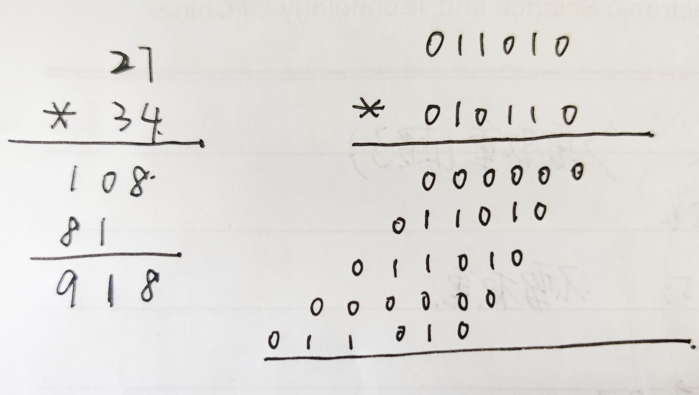

## 位运算

#### 异或运算

1. 0 ^ N = N
2. N ^ N = 0
3. 满足交换律与结合律

* **交换两个数的值**

  ```java
  private static void swap(int[] arr, int i, int j) {
          if (i == j) {
              return;
          }
          arr[i] = arr[i] ^ arr[j];
          arr[j] = arr[i] ^ arr[j];
          arr[i] = arr[i] ^ arr[j];
      }
  ```

* **奇数问题**

  一整形数组，已知只有两种数出现奇数次，其他都出现偶数次

  1. **思路**

     ​	让数组中的每个数异或一遍，因为异或运算满足交换律和结合律，且两个相同的的数异或出来为0，任意一个数异或0值不变。

     所以异或完的结果，就是两个奇数的异或结果。

     ​	从右边取结果的不为0的一位 i，那么这一位不为0就说明，这两个奇数在这个位置上不相同。重新遍历数组，依然让每一个元素相互异或，但是要判断一下这个元素在 i 位置是否是否为0，是0才异或，否则跳过。

  2. **代码实现**

     ```java
     	public static void findOddTimeNum(int[] arr) {
             int eor1 = 0;
             for (int p1 : arr) {
                 eor1 ^= p1;
             }
             int rightOne = eor1 & (~eor1 + 1);
             int eor2 = 0;
             for (int p2 : arr) {
                 if ((p2 & rightOne) == 0) {
                     eor2 ^= p2;
                 }
             }
             System.out.println(eor2);
             System.out.println(eor1 ^ eor2);
         }
     ```

  右边第一位不为0的数：```eor & (~eor + 1)```

  

* **除以二问题**

  ```JAVA
  mid = L + (R - L) >> 1;
  ```

  > 这样可以防止溢出，而且更快，位运算要比除以二快
  
* **2的n次方公式**

  ```2 ^ n = 1 << n;```
  
* `>>>`

  无符号右移，正数负数同样高位补0

  >  `>>`是右移，若为负数，高位补1，正数高位补0

* **补码**

  正数的补码等于源码，负数的补码等于原码的反码加一

  > 反码就是除了符号位, 其他的取反

  计算机中, 负数是通过补码的形式来保存的, 所以类型为`int`的-1, 在计算机中的表示形式为

  `11111111 11111111 11111111 11111111`
  
* **判断奇数偶数**

  `i & 1 == 0` 

  偶数并1为0，奇数并1为1
  
* **判断两个数大小**

  > 判断两个数大小，但是不能用任何比较，这里 a-b 可能有溢出的情况

  ```java
  	public static int getBigerOne(int a, int b) {
          //可能溢出
          int diff = a - b;
          int sa = a >>> 31;
          int sb = b >>> 31;
          int signDiff = sa ^ sb;
          int sign = diff >>> 31;
          int resDiff = (1 - sa) * a + (1 - sb) * b;
          int resSame = a * (1 - sign) + b * sign;
          return (1 - signDiff) * resSame + signDiff * resDiff;
      }
  ```

  > 只有当符号不同的候，才有可能溢出，所以符号不同的时候单独弄一个

* **判断一个32位正数是不是2的幂，4的幂**

  ```java
  	public static boolean is2Mi(int num) {
         /* if (num <= 0) {
              return false;
          }
          int rightOne = (num & (~num + 1));
          if (num - rightOne != 0) {
              return false;
          }
          return true;*/
          return (num & (num - 1)) == 0;
      }
  
      public static boolean is4Mi(int num) {
          /*if (num <= 0) {
              return false;
          }
          int rightOne = (num & (~num + 1));
          int i = 0;
          while (rightOne != 1) {
              rightOne = rightOne >> 1;
              i++;
          }
          return i % 2 == 0;*/
          return (num & (num - 1)) == 0 && (num & 0x55555555) != 0;
      }
  ```

> 2的幂只有一个位为1，别的都是0
>
> 4的幂只有一个位为1，而且这个位置在0，2，4，6...即偶数
>
> 0x代表16进制，一个数占4bit，一个int4字节32bit，所以要8个16进制数来表示

* **得到一个数的相反数**

  `~n + 1`

* **实现加减乘除运算**

  > 要求计算过程不发生溢出

  1. 加法

     * 流程

       两个数无进位加法（异或）的结果a + 两个数的进位信息向左移动一位的结果b，对于a和b继续使用这样的加法，直到没有进位信息为0	了，那么就说明没有进位信息，无进位的异或结果就是加法结果

       > 总有进位信息消失的时候

     * 代码实现

       ```java
       public static int sum(int a, int b) {
               int resY = a ^ b;
               int resJ = (a & b) << 1;
               int temp;
               while (resJ != 0) {
                   temp = resY ^ resJ;
                   resJ = (resY & resJ) << 1;
                   resY = temp;
               }
               return resY;
           }
       ```

       > 注意这个声明的temp变量，不要在无进位加法的结果还没被进位信息使用的时候，就把它的结果改变了

  2. 减法

     * 流程

       减一个数就相当于加一个数的相反数

     * 代码实现

       ```java
       	public static int sub(int a, int b) {
               return sum(a, sum(~b, 1));
           }
       ```

  3. 乘法

     

     * **代码实现**
  
       ```java
       	public static int multiply(int a, int b) {
               int res = 0;
               int num = 0;
               while (b != 0) {
                   if ((b & 1) != 0) {
                       res = sum(res, a << num);
                   }
                   num++;
                   b >>>= 1;
               }
               return res;
           }
       ```
     
       
     
     
     
     
     
     
