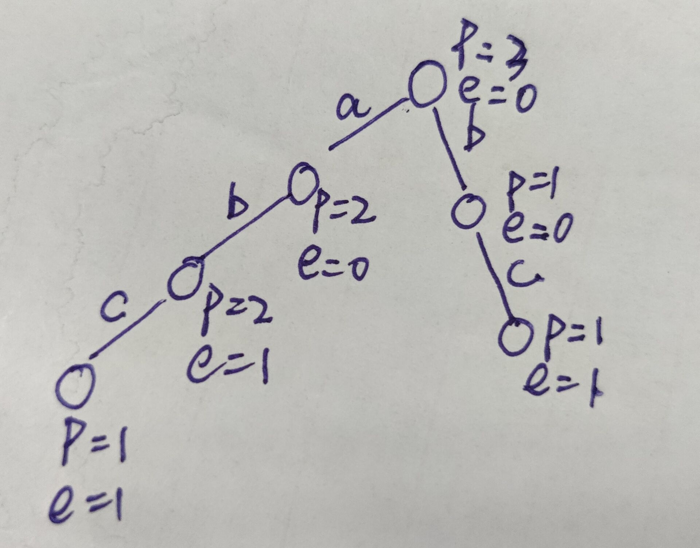

## 前缀树

#### 构造一棵前缀树

1. **样本**

   ``` [ "abc", "ab", "bc"]```

2. **构造树**

   

   > 注意，字符是在边上面的。通过这棵树，既可以找到是否含有特定字符串，也可以找到有多少个字符串是以`ab`作为前缀的

   > p代表pass，表示有几个字符串通过了这个节点，e代表end，表示有几个字符串是以这个节点作为结尾的

3. **工具代码**

   * `TrieNode`

     ```java
     	public static class TrieNode {
             public int pass;
             public int end;
             public TrieNode[] nexts;
     
             public TrieNode() {
                 pass = 0;
                 end = 0;
                 //nexts[0] == null 没有走向a的路
                 //nexts[0] != null 有走向a的路
                 nexts = new TrieNode[26];
             }
         }
     ```

     > ​	如果字符串种类很多的话，可以把`TrieNode`数组换成哈希表`HashMap<char, TrieNode>`，原数组就是下标为26个小写字母的映射，所以key为字符，value为字符对应的数组。

   * 插入一个字符串

     ```java
     public static class Trie {
             private TrieNode root;
     
             public Trie() {
                 this.root = new TrieNode();
             }
     
             public void insert(String word) {
                 if (word == null) {
                     return;
                 }
                 char[] words = word.toCharArray();
                 TrieNode node = root;
                 node.pass++;
                 int index = 0;
                 for (char c : words) {
                     index = c-'a';
                     if(node.nexts[index] == null){
                         node.nexts[index] = new TrieNode();
                     }
                     node.nexts[index].pass++;
                 }
                 node.end++;
             }
         }
     ```

     > 把字符串转成字符数组，然后遍历字符，每个字符对应next的下标为`int index = char - 'a'`

     > 注意这里最前面判断的时候不要过滤空，可能有空字符串。

   * **查找一个字符串出现过几次**

     ```java
     	public int search(String word) {
                 if (word == null) {
                     return 0;
                 }
                 char[] words = word.toCharArray();
                 TrieNode node = root;
                 int index = 0;
                 for (int i = 0; i < words.length; i++) {
                     index = words[i] - 'a';
                     if (node.nexts[index] == null) {
                         return 0;
                     }
                     node = node.nexts[index];
                 }
                 return node.end;
             }
     ```

     > 结尾节点的end值，注意前缀树上面的字符是出现在边上面的，不要惯性思维！！！

   * **所有加入的字符中，有多少是以`pre`作为字符串前缀的**

     ```java
     	public int prefixNumber(String word) {
                 if (word == null) {
                     return 0;
                 }
                 TrieNode node = root;
                 char[] words = word.toCharArray();
                 int index = 0;
                 for (int i = 0; i < words.length; i++) {
                     index = words[i] - 'a';
                     if (node.nexts[index] == null) {
                         return 0;
                     }
                     node = node.nexts[index];
                 }
                 return node.pass;
             }
     ```

     > 返回`pre`字符串结尾节点的pass数值

   * **删除word**

     ​	**流程：**

     ​		首先要检查这个词在不在里面， 要是不在的话，删到最后面才发现，那前面的就白删了。

     ​		自减沿途的pass值，再自减最后的节点end与pass值。

     ​		如果pass值已经减为0，那么把后面字符全释放掉 

     **代码实现**

     ```java
     public void delete(String word) {
         if (word == null) {
             return;
         }
         if (search(word) <= 0) {
             return;
         }
         TrieNode node = root;
         node.pass--;
         int index = 0;
         char[] words = word.toCharArray();
         for (int i = 0; i < words.length; i++) {
             index = words[i] = 'a';
             if (--node.nexts[index].pass == 0) {
                 node.nexts[index] = null;
                 return;
             }
             node = node.nexts[index];
         }
         node.end--;
     }
     ```

     > ​	注，如果发现字符对应的下个节点的pass值被减为0了，那么直接把下个节点置为空，`jvm`会自动把这个null以及下面的节点释放掉，于是直接返回就可以了。

     

     

     

     

