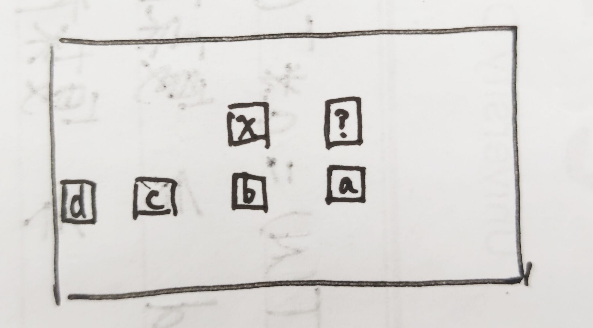

## 动态规划

> 总流程：写出递归函数 -> 改成记忆化递归函数 -> 改成动态规划版本

* **例题**

  1. **问题描述**

     给定n个位置，n>1，s为初始位置，e为结尾位置，k为机器人必须走k步。机器人每次只能往左或者往右一步，求从s出发，经过k步走到e，有几种走法

  2. **递归解决**

     ```java
     	public static int f(int N, int E, int rest, int cur) {
             if (rest == 0) {
                 return cur == E ? 1 : 0;
             }
             if (cur == 1) {
                 return f(N, E, rest - 1, 2);
             }
             if (cur == N) {
                 return f(N, E, rest - 1, N - 1);
             }
             return f(N, E, rest - 1, cur + 1) + f(N, E, rest - 1, cur - 1);
         }
     ```

  3. **递归问题**

     

     > 由此可以发现，如果使用递归算出后，如果再次遇到`f(2,2)`，递归函数还会重新运算

     * **记忆化搜索方法，加入缓存**

       ```java
       	public static int walkWay2(int N, int E, int K, int S) {
               int[][] dp = new int[K + 1][N + 1];
               for (int i = 0; i <= K; i++) {
                   for (int j = 0; j <= N; j++) {
                       dp[i][j] = -1;
                   }
               }
               return f2(N, E, K, S, dp);
           }
           
           public static int f2(int N, int E, int rest, int cur, int[][] dp) {
               if (dp[rest][cur] != -1) {
                   return dp[rest][cur];
               }
               if (rest == 0) {
                   dp[rest][cur] = cur == E ? 1 : 0;
                   return dp[rest][cur];
               }
               if (cur == 1) {
                   dp[rest][cur] = f2(N, E, rest - 1, 2, dp);
                   return dp[rest][cur];
               }
               if (cur == N) {
                   dp[rest][cur] = f2(N, E, rest - 1, N - 1, dp);
                   return dp[rest][cur];
               }
               dp[rest][cur] = f2(N, E, rest - 1, cur + 1, dp) + f2(N, E, rest - 1, cur - 1, dp);
               return dp[rest][cur];
           }
       ```

     * **动态规划（表结构）**

       

       从2开始，走四步到4，建立5*6的表格，列表示cur，即当前来到的位置。行表示rest，即当前还剩多少步。

       * 根据递归代码，通过`basecase`来找到初始条件
       * 通过其他代码部分，得到依赖关系，如图
       * 从上到下依次填表，求※处位置的值就是问题的解

       > 这个就是动态转移方程，先写出递归，再通过递归找

* **例题**

  1. **问题描述**

     给一个数组arr，里面摆放的都是一个个硬币，数组中的数值为硬币的面额，现在给定一个目标值，求拿最少的硬币数得到目标值

  2. **递归代码实现**

     ```java
     	public static int getMin(int[] arr, int rest, int i) {
             if (rest == 0) {
                 return 0;
             }
             if (rest < 0) {
                 return -1;
             }
             if (i == arr.length) {
                 return -1;
             }
             int res1 = getMin(arr, rest - arr[i], i + 1);
             int res2 = getMin(arr, rest, i + 1);
             if (res1 == -1 && res2 == -1) {
                 return -1;
             }
             if (res1 == -1) {
                 return res2;
             }
             if (res2 == -1) {
                 return 1 + res1;
             }
             return Math.min(res1 + 1, res2);
         }
     ```

  3. **加缓存的递归实现**

     ```java
     	public static int getResult(int[] arr, int aim) {
             int[][] dp = new int[arr.length + 1][aim + 1];
             for (int i = 0; i < dp.length; i++) {
                 for (int j = 0; j < dp[0].length; j++) {
                     dp[i][j] = -2;
                 }
             }
             return getMin2(arr, aim, 0, dp);
         }
     
         private static int getMin2(int[] arr, int rest, int i, int[][] dp) {
             if (rest < 0) {
                 return -1;
             }
             if (dp[i][rest] != -2) {
                 return dp[i][rest];
             }
             if (rest == 0) {
                 dp[i][rest] = 0;
                 return dp[i][rest];
             }
             if (i == arr.length) {
                 dp[i][rest] = -1;
                 return dp[i][rest];
             }
             int res1 = getMin(arr, rest - arr[i], i + 1);
             int res2 = getMin(arr, rest, i + 1);
             if (res1 == -1 && res2 == -1) {
                 dp[i][rest] = -1;
             } else if (res1 == -1) {
                 dp[i][rest] = res2;
             } else if (res2 == -1) {
                 dp[i][rest] = 1 + res1;
             } else {
                 dp[i][rest] = Math.min(res1 + 1, res2);
             }
             return dp[i][rest];
         }
     ```

  4. **递归转动态规划**

     ```java
     	public static int getResultDP(int[] arr, int rest) {
             int N = arr.length;
             int[][] dp = new int[N + 1][rest + 1];
             for (int i = 0; i <= N; i++) {
                 dp[i][0] = 0;
             }
             for (int j = 1; j <= rest; j++) {
                 dp[N][j] = -1;
             }
             for (int i = N - 1; i >= 0; i--) {
                 for (int j = 1; j <= rest; j++) {
     
                     int res1 = -1;
                     if (j - arr[i] >= 0) {
                         res1 = dp[i + 1][j - arr[i]];
                     }
                     int res2 = dp[i + 1][j];
     
                     if (res1 == -1 && res2 == -1) {
                         dp[i][j] = -1;
                     } else if (res1 == -1) {
                         dp[i][j] = res2;
                     } else if (res2 == -1) {
                         dp[i][j] = 1 + res1;
                     } else {
                         dp[i][j] = Math.min(res1 + 1, res2);
                     }
                 }
             }
             return dp[0][rest];
         }
     ```

     * 首先初始化边界条件
     
       > 注意这里左下角的值没用，不用初始化为-1，反正也用不到
     
     * 然后看递归函数里面，每个值依赖数组中哪两个位置的值，决定dp数组的填写顺序
     
     * 将加缓存的递归实现里面的东西都拷进填写dp数组的双重循环里面，然后删删减减改改就好了
     
     * 最后返回数组中目标位置的值
  
* **例题**

  1. **问题描述**

     绝顶聪明的两个人拿卡牌

  2. **递归解决**

     ```java
     	public static int firstHand(int[] arr, int L, int R) {
             if (L == R) {
                 return arr[L];
             }
             return Math.max(arr[L] + lastHand(arr, L + 1, R), arr[R] + lastHand(arr, L, R - 1));
         }
     
         private static int lastHand(int[] arr, int L, int R) {
             if (L == R) {
                 return 0;
             }
             return Math.min(firstHand(arr, L + 1, R), firstHand(arr, L, R - 1));
         }
     ```

  3. **主函数调用**

     ```java
      	public static int win1(int[] arr) {
             if (arr == null || arr.length == 0) {
                 return 0;
             }
             return Math.max(
                     firstHand(arr, 0, arr.length - 1),
                     lastHand(arr, 0, arr.length - 1)
             );
         }
     ```

  4. **动态规划版本**

     * 看递归中变参的取值范围确定dp数组大小
     * 看主函数调用，看需要dp数组上哪个位置的结果
     * 将`basecase`的边界条件填表
     * 看普遍条件如何依赖

     ```java
     	public static int win2(int[] arr) {
             if (arr == null || arr.length == 0) {
                 return 0;
             }
             int[][] fArr = new int[arr.length][arr.length];
             int[][] lArr = new int[arr.length][arr.length];
             for (int j = 0; j < fArr.length; j++) {
                 fArr[j][j] = arr[j];
             }
             for (int col = 1; col < arr.length; col++) {
                 for (int j = col, i = 0; j < arr.length; i++, j++) {
                     fArr[i][j] = Math.max(arr[i] + lArr[i + 1][j], arr[j] + lArr[i][j - 1]);
                     lArr[i][j] = Math.min(fArr[i + 1][j], fArr[i][j - 1]);
                 }
             }
             return Math.max(fArr[0][arr.length - 1], lArr[0][arr.length - 1]);
         }
     ```

     > 注意这里遍历对角线的时候，每次 i 都是从0开始的，列 j 则不一样

* **例题**

  1. **问题描述**

     马踏飞燕问题，在一张棋盘上，规定马的初始位置为(0,0)，终止位置(a,b)，要求马走k步到达，求有几种行走方式

  2. **递归解决**

     ```java
     	private static int process(int x, int y, int a, int b, int k, int length, int width) {
             if (k == 0) {
                 if (x == a && y == b) {
                     return 1;
                 }
                 return 0;
             }
             if (x < 0 || x > width || y < 0 || y > length) {
                 return 0;
             }
             return process(x - 1, y + 2, a, b, k - 1, length, width) +
                     process(x + 1, y + 2, a, b, k - 1, length, width) +
                     process(x + 2, y + 1, a, b, k - 1, length, width) +
                     process(x + 2, y - 1, a, b, k - 1, length, width) +
                     process(x + 1, y - 2, a, b, k - 1, length, width) +
                     process(x - 1, y - 2, a, b, k - 1, length, width) +
                     process(x - 2, y - 1, a, b, k - 1, length, width) +
                     process(x - 2, y + 1, a, b, k - 1, length, width);
     
         }
     ```

     > 注意这里调用递归的时候，边界问题不用讨论，如果出界的在`baseCase`里面解决就可以

  3. **主函数调用**

     ```java
     	public static int countSteps(int a, int b, int k, int length, int width) {
             return process(0, 0, a, b, k, length, width);
         }
     ```

  4. **动态规划方法**

     ```java
     	public static int countSteps2(int a, int b, int k, int length, int width) {
             int[][][] dp = new int[width + 1][length + 1][k + 1];
             for (int i = 0; i <= width; i++) {
                 for (int j = 0; j <= length; j++) {
                     if (i == a && j == b) {
                         dp[i][j][0] = 1;
                     } else {
                         dp[i][j][0] = 0;
                     }
                 }
             }
             for (int height = 1; height <= k; height++) {
                 for (int i = 0; i <= width; i++) {
                     for (int j = 0; j <= length; j++) {
                         dp[i][j][height] += ifOut(i - 1, j + 2, length, width) ? 0 : dp[i - 1][j + 2][height - 1];
                         dp[i][j][height] += ifOut(i - 1, j - 2, length, width) ? 0 : dp[i - 1][j - 2][height - 1];
                         dp[i][j][height] += ifOut(i + 2, j + 1, length, width) ? 0 : dp[i + 2][j + 1][height - 1];
                         dp[i][j][height] += ifOut(i + 2, j - 1, length, width) ? 0 : dp[i + 2][j - 1][height - 1];
                         dp[i][j][height] += ifOut(i + 1, j - 2, length, width) ? 0 : dp[i + 1][j - 2][height - 1];
                         dp[i][j][height] += ifOut(i + 1, j + 2, length, width) ? 0 : dp[i + 1][j + 2][height - 1];
                         dp[i][j][height] += ifOut(i - 2, j - 1, length, width) ? 0 : dp[i - 2][j - 1][height - 1];
                         dp[i][j][height] += ifOut(i - 2, j + 1, length, width) ? 0 : dp[i - 2][j + 1][height - 1];
                     }
                 }
             }
             return dp[0][0][k];
         }
     ```

* **例题**

  1. **问题描述**

     一个小人Bob，在一个row*col大小的格子里，让Bob走K步，每次Bob随机上下左右走，Bob走到格子外面就死了，求Bob存活下来的概率

  2. **递归方法**

     ```java
     private static int KAlive(int x, int y, int k, int row, int col) {
             if (x < 0 || x > col || y < 0 || y > row) {
                 return 0;
             }
             if (k == 0) {
                 return 1;
             }
             return KAlive(x - 1, y, k - 1, row, col) +
                     KAlive(x, y + 1, k - 1, row, col) +
                     KAlive(x + 1, y, k - 1, row, col) +
                     KAlive(x, y - 1, k - 1, row, col);
         }
     
         private static int KNum(int x, int y, int k, int row, int col) {
             if (k == 0) {
                 return 1;
             }
             return 4 * KNum(x - 1, y, k - 1, row, col);
     //                KNum(x, y + 1, k - 1, row, col) +
     //                KNum(x + 1, y, k - 1, row, col) +
     //                KNum(x, y - 1, k - 1, row, col);
         }
     ```

     > 发现了`kNum`的规律，之和K有关，`kNum = Math.pow(4, k)`

  3. **主函数调用**

     ```java
         public static double aliveP(int a, int b, int k, int row, int col) {
             if (a < 0 || a >= col || b < 0 || b >= row) {
                 return 0;
             }
             return (double) KAlive(a, b, k, row, col) / (double) KNum(a, b, k, row, col);
         }
     ```

  4. **动态规划方法**

     ```java
         public static double aliveP2(int a, int b, int k, int row, int col) {
             if (a < 0 || a > col || b < 0 || b > row) {
                 return 0;
             }
             double kNum = Math.pow(4, k);
             int[][][] dp = new int[col + 1][row + 1][k+1];
             for (int i = 0; i <= col; i++) {
                 for (int j = 0; j <= row; j++) {
                     dp[i][j][0] = 1;
                 }
             }
             for (int h = 1; h <= k; h++) {
                 for (int i = 0; i <= col; i++) {
                     for (int j = 0; j <= row; j++) {
                         dp[i][j][h] += ifOut(i - 1, j, col, row) ? 0 : dp[i - 1][j][h - 1];
                         dp[i][j][h] += ifOut(i, j + 1, col, row) ? 0 : dp[i][j + 1][h - 1];
                         dp[i][j][h] += ifOut(i + 1, j, col, row) ? 0 : dp[i + 1][j][h - 1];
                         dp[i][j][h] += ifOut(i, j - 1, col, row) ? 0 : dp[i][j - 1][h - 1];
                     }
                 }
             }
             return dp[a][b][k] / kNum;
         }
     ```

     > 注意当发现动态规划的结果为0时，可能有两种情况：
     >
     > 1. dp下标带错了，写成了函数中的参数
     > 2. +=写成了=

* **例题**

  1. **问题描述**

     给一个arr，里面所有值都是正，没有重复值，每一个位置代表一个面值的货币，一个面值可以有任意张，现在用这些货币组成1000块钱，问有多少种组合。

  2. **递归实现**

     ```java
     	private static int process1(int rest, int i, int[] arr) {
             if (rest == 0) {
                 return 1;
             }
             if (i == arr.length) {
                 return 0;
             }
             int res = 0;
             for (int num = 1; rest - arr[i] * num >= 0; num++) {
                 res += process1(rest - arr[i] * num, i + 1, arr);
             }
             return res + process1(rest, i + 1, arr);
         }
     ```

  3. **主函数调用**

     ```java
         public static int getNums(int aim, int[] arr) {
             if (arr == null || arr.length == 0) {
                 return 0;
             }
             return process1(aim, 0, arr);
         }
     ```

  4. **动态规划实现**

     ```java
     	public static int getNums2(int aim, int[] arr) {
             if (arr == null || arr.length == 0) {
                 return 0;
             }
             int[][] dp = new int[aim + 1][arr.length + 1];
             for (int i = 0; i <= arr.length; i++) {
                 dp[0][i] = 1;
             }
             for (int rest = 1; rest <= aim; rest++) {
                 dp[rest][arr.length] = 0;
             }
             for (int i = arr.length - 1; i >= 0; i--) {
                 for (int rest = 1; rest <= aim; rest++) {
                     for (int num = 1; rest - arr[i] * num >= 0; num++) {
                         dp[rest][i] += dp[rest - arr[i] * num][i + 1];
                     }
                     dp[rest][i] += dp[rest][i + 1];
                 }
             }
             return dp[aim][0];
         }
     ```

     > 注意在初始化dp矩阵的时候，原递归函数中先返回的优先级高，后面再返回的不能把前面的值覆盖，是前面的覆盖后面的
     >
     > 还有就是0的位置初始化的时候不用管！！

     > 这里在填写dp数组的时候，有枚举循环行为，如果不优化的话，时间复杂度会高

  5. **枚举类型的dp优化（斜率优化）**

     > 就是在填dp表的时候，发现填一个值需要遍历一些值，这时是可以优化的，这种优化只和观察有关，和逻辑无关

     

     比如？处的值等于`a+b+c+d`，这就是一个需要遍历的过程，但是我们可以发现x处的值等于`b+c+d`，所以？处的值等于`x+a`

     * **优化后代码**

       ```java
           public static int getNums2(int aim, int[] arr) {
               if (arr == null || arr.length == 0) {
                   return 0;
               }
               int[][] dp = new int[aim + 1][arr.length + 1];
               for (int i = 0; i <= arr.length; i++) {
                   dp[0][i] = 1;
               }
               for (int i = arr.length - 1; i >= 0; i--) {
                   for (int rest = 1; rest <= aim; rest++) {
                       if (rest - arr[i] >= 0) {
                           dp[rest][i] = dp[rest - arr[i]][i] + dp[rest][i + 1];
                       } else {
                           dp[rest][i] = dp[rest][i + 1];
                       }
                   }
               }
               return dp[aim][0];
           }
       ```

     > 评价尝试的好坏：
     >
     > * 单参数的维度
     > * 可变参数的个数