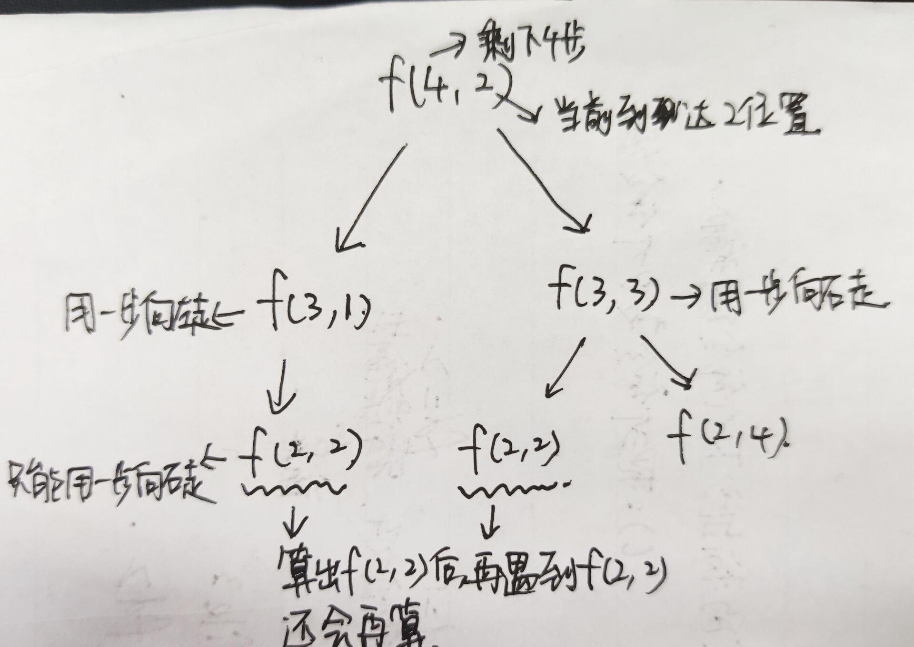
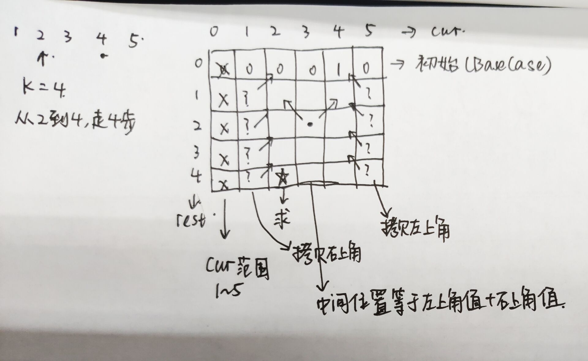

## 动态规划

> 总流程：写出递归函数 -> 改成记忆化递归函数 -> 改成动态规划版本

* **例题**

  1. **问题描述**

     给定n个位置，n>1，s为初始位置，e为结尾位置，k为机器人必须走k步。机器人每次只能往左或者往右一步，求从s出发，经过k步走到e，有几种走法

  2. **递归解决**

     ```java
     	public static int f(int N, int E, int rest, int cur) {
             if (rest == 0) {
                 return cur == E ? 1 : 0;
             }
             if (cur == 1) {
                 return f(N, E, rest - 1, 2);
             }
             if (cur == N) {
                 return f(N, E, rest - 1, N - 1);
             }
             return f(N, E, rest - 1, cur + 1) + f(N, E, rest - 1, cur - 1);
         }
     ```

  3. **递归问题**

     

     > 由此可以发现，如果使用递归算出后，如果再次遇到`f(2,2)`，递归函数还会重新运算

     * **记忆化搜索方法，加入缓存**

       ```java
       	public static int walkWay2(int N, int E, int K, int S) {
               int[][] dp = new int[K + 1][N + 1];
               for (int i = 0; i <= K; i++) {
                   for (int j = 0; j <= N; j++) {
                       dp[i][j] = -1;
                   }
               }
               return f2(N, E, K, S, dp);
           }
           
           public static int f2(int N, int E, int rest, int cur, int[][] dp) {
               if (dp[rest][cur] != -1) {
                   return dp[rest][cur];
               }
               if (rest == 0) {
                   dp[rest][cur] = cur == E ? 1 : 0;
                   return dp[rest][cur];
               }
               if (cur == 1) {
                   dp[rest][cur] = f2(N, E, rest - 1, 2, dp);
                   return dp[rest][cur];
               }
               if (cur == N) {
                   dp[rest][cur] = f2(N, E, rest - 1, N - 1, dp);
                   return dp[rest][cur];
               }
               dp[rest][cur] = f2(N, E, rest - 1, cur + 1, dp) + f2(N, E, rest - 1, cur - 1, dp);
               return dp[rest][cur];
           }
       ```

     * **动态规划（表结构）**

       

       从2开始，走四步到4，建立5*6的表格，列表示cur，即当前来到的位置。行表示rest，即当前还剩多少步。

       * 根据递归代码，通过`basecase`来找到初始条件
       * 通过其他代码部分，得到依赖关系，如图
       * 从上到下依次填表，求※处位置的值就是问题的解

       > 这个就是动态转移方程，先写出递归，再通过递归找

* **例题**

  1. **问题描述**

     给一个数组arr，里面摆放的都是一个个硬币，数组中的数值为硬币的面额，现在给定一个目标值，求拿最少的硬币数得到目标值

  2. **递归代码实现**

     ```java
     	public static int getMin(int[] arr, int rest, int i) {
             if (rest == 0) {
                 return 0;
             }
             if (rest < 0) {
                 return -1;
             }
             if (i == arr.length) {
                 return -1;
             }
             int res1 = getMin(arr, rest - arr[i], i + 1);
             int res2 = getMin(arr, rest, i + 1);
             if (res1 == -1 && res2 == -1) {
                 return -1;
             }
             if (res1 == -1) {
                 return res2;
             }
             if (res2 == -1) {
                 return 1 + res1;
             }
             return Math.min(res1 + 1, res2);
         }
     ```

  3. **加缓存的递归实现**

     ```java
     	public static int getResult(int[] arr, int aim) {
             int[][] dp = new int[arr.length + 1][aim + 1];
             for (int i = 0; i < dp.length; i++) {
                 for (int j = 0; j < dp[0].length; j++) {
                     dp[i][j] = -2;
                 }
             }
             return getMin2(arr, aim, 0, dp);
         }
     
         private static int getMin2(int[] arr, int rest, int i, int[][] dp) {
             if (rest < 0) {
                 return -1;
             }
             if (dp[i][rest] != -2) {
                 return dp[i][rest];
             }
             if (rest == 0) {
                 dp[i][rest] = 0;
                 return dp[i][rest];
             }
             if (i == arr.length) {
                 dp[i][rest] = -1;
                 return dp[i][rest];
             }
             int res1 = getMin(arr, rest - arr[i], i + 1);
             int res2 = getMin(arr, rest, i + 1);
             if (res1 == -1 && res2 == -1) {
                 dp[i][rest] = -1;
             } else if (res1 == -1) {
                 dp[i][rest] = res2;
             } else if (res2 == -1) {
                 dp[i][rest] = 1 + res1;
             } else {
                 dp[i][rest] = Math.min(res1 + 1, res2);
             }
             return dp[i][rest];
         }
     ```

  4. **递归转动态规划**

     ```java
     	public static int getResultDP(int[] arr, int rest) {
             int N = arr.length;
             int[][] dp = new int[N + 1][rest + 1];
             for (int i = 0; i <= N; i++) {
                 dp[i][0] = 0;
             }
             for (int j = 1; j <= rest; j++) {
                 dp[N][j] = -1;
             }
             for (int i = N - 1; i >= 0; i--) {
                 for (int j = 1; j <= rest; j++) {
     
                     int res1 = -1;
                     if (j - arr[i] >= 0) {
                         res1 = dp[i + 1][j - arr[i]];
                     }
                     int res2 = dp[i + 1][j];
     
                     if (res1 == -1 && res2 == -1) {
                         dp[i][j] = -1;
                     } else if (res1 == -1) {
                         dp[i][j] = res2;
                     } else if (res2 == -1) {
                         dp[i][j] = 1 + res1;
                     } else {
                         dp[i][j] = Math.min(res1 + 1, res2);
                     }
                 }
             }
             return dp[0][rest];
         }
     ```

     * 首先初始化边界条件
     * 然后看递归函数里面，每个值依赖数组中哪两个位置的值，决定dp数组的填写顺序
     * 将加缓存的递归实现里面的东西都拷进填写dp数组的双重循环里面，然后删删减减改改就好了
     * 最后返回数组中目标位置的值