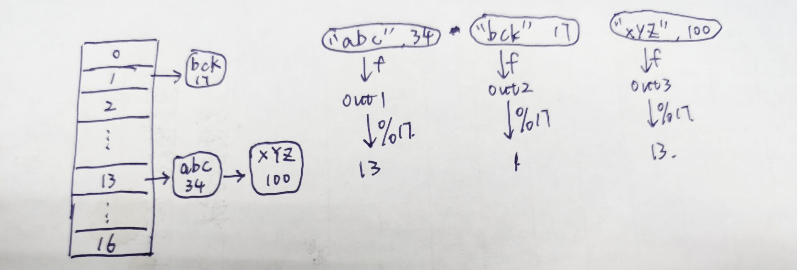
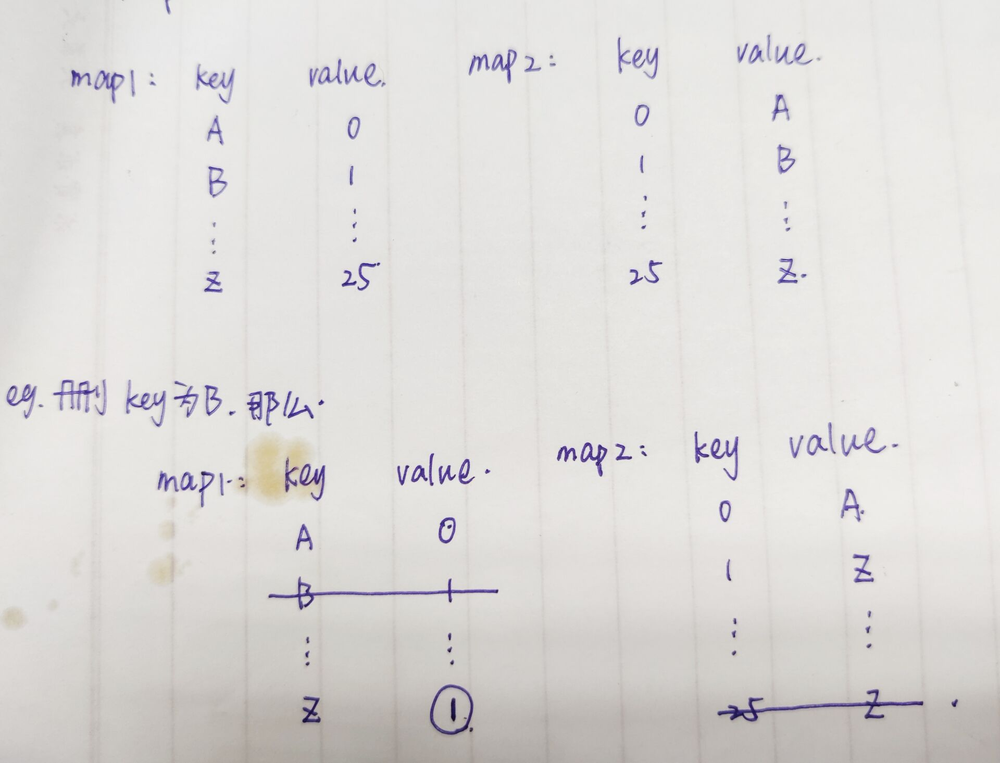
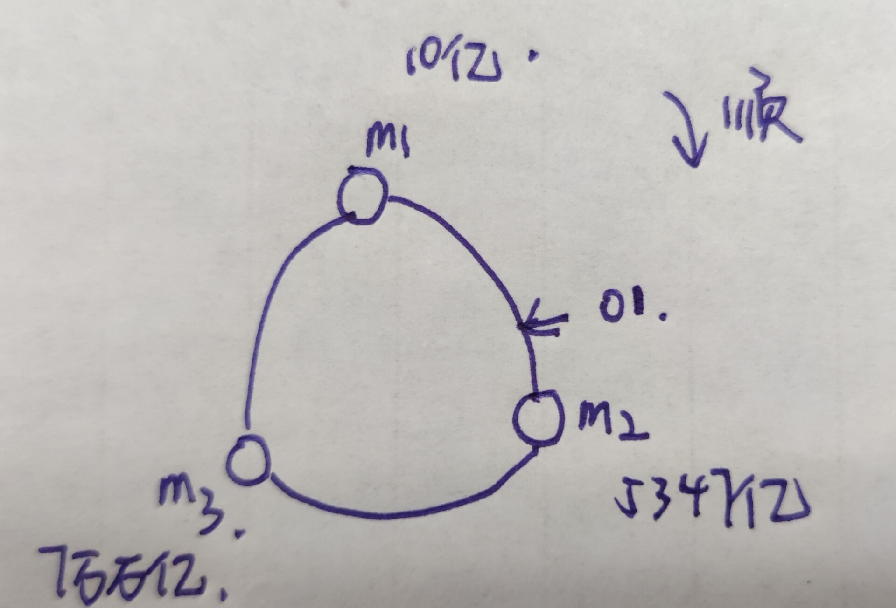
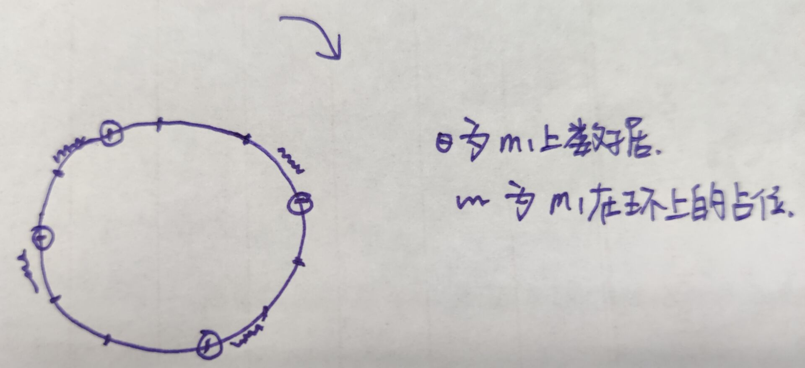

## 哈希函数

1. **规定**

   * 输入域是无穷的
   * 输出域是有限的

   > `MD5`返回的范围在 0~2^64-1 （相当于16位16进制的字符拼接形成的字符串）
   >
   > `SHA1`返回值在0~2^128-1（相当于32位16进制的字符拼接形成的字符串）

2. **哈希碰撞**

   不同输入对应相同输出概率特别低

3. **性质**

   满足均匀性和离散型，即使输入有规律，输出也没有规律。一个哈希函数的均匀性和离散性越好，说明哈希函数越优秀。

   > 比如位运算，每一位与每一位进行不同的位运算。
   >
   > 哈希函数满足均匀分布，那么对于输出%m，模完的值同样在0~m-1上均匀分布v

   #### 例题

   1. **问题描述**

      有一个大文件，里面包含了40亿个无符号整数，现在给`1GB`的内存，找到出现最多的数字是哪个

   2. **排除哈希表**

      **原因**：哈希表的key和value都是int，每个都占4个字节，那么一条记录就有8字节。因为无符号整数的范围是`0~2^32-1`

      ，所以在最坏的情况下（即所有无符号整数都不相同），那么即使不考虑哈希表占用的内存，key和value已经占用了

      `4 * 10^9 * 8 B = 32GB`，已经超出了内存限制，所以不行

      > `1KB = 10^3B 1MB = 10^6B 1GB = 10^9B 10^9=10亿`

   3. **解决方法**

      ​	对所有的数进行hash函数运算后，再取100的模，然后按照取模的结果，把这些数放到0-99个小文件中（外存？），因此，这时对文件最大的那个小文件使用哈希表即可，这时哈希表占用空间就是32/100 ，不会超过一个G的限制

      > 这里不用担心同一个数字出现太多，然后小文件和大文件占用外存空间差不多的情况。
      >
      > 因为如果相同的出现再多，在哈希表中也是一条记录~

### 哈希表的实现

* **原理**

  ​	比如一条记录`"abc", 34`，首先对`abc`进行hash运算得到输出结果`out1`，然后对`out1`取模运算，结果就是当前记录在哈希表中应该存放的记录位置。哈希表上的每个节点是个链表，如果当前位置已经有值了，那么就在这个值的后面，加入当前值。

  

  > 因为hash函数的均匀离散性，所以取模后的值也是均匀分布的，那么就相当于链表是均匀变长的。

* **扩容流程**

  * ​	当哈希表的一条链的长度到达规定值x时，由于hash函数的均匀离散性，可以认为其他链的长度也到达了x，那么将容量变为原来的两倍
  *    然后将所有的值重新哈希到这个新的表上。因为hash函数的均匀离散性，在这个新表上也会均匀分布，每个链的长度基本相同，所以每个链的长度变为原来的1/2，即x/2。

* **扩容代价**

  * 调用hash为O(1)，大常数，取模O(1)，如果链表长度不长的话，遍历链表O(1)，所以对所有元素而言，每次扩容代价为O(n)
  * 假设哈希表最初大小为2，且链表长度为2时就要扩容，那么N个数据就要扩容`logN`次，所以扩容次数的级别是`logn`级别的，只不过常数很小
  * 所以，**理论上认为**扩容的总代价为`O(N*logN)`，那么平均每次操作哈希表的代价就是`O(logN)`

* **为什么可以认为哈希表单次使用时O(1)级别的**

  * 可以把扩容的触发条件（即链表达到多长时，触发扩容），链表长度设置很长，这样就可以极大的减少扩容的代价，会让扩容次数`logN`的常数项变得特别小
  * 而且在操作哈希表的时候，不仅有加入，还有删除
  * 其次，在扩容的时候，用户可以继续使用原来的老表，新建一个新的线程去完成扩容任务，当新表建立完成后，用户再去使用新表操作。

#### 设计`RandomPool`结构

1. **问题描述**

   设计一种结构，该结构有三个功能

   * `insert(key)`：将某个key加入到该结构，做到不重复加入
   * `delete(key)`：将原本结构中的某个key移除
   * `getRandom()`：等概率随机返回结构中的任何一个key

2. **流程分析**

   * 建立两个hash表，h1为str到index的对应，h2为index到str的对应，设置变量size

   * 插入一个key对应的操作为：在h1中key为要插入的key，value为size，然后在h2中反过来插入，插完了size++

   * 随机等概率返回key的操作为，用random就可以了

   * 删除一个key对应的操作为：

     1. 在h1中找到key对应的value，然后将这个表的最后一个元素的value设置为待删除key的value，然后删除目标key对应的那条数据
     2. 在h2中把待删key的那对数据的value，改为最后一个记录的value（就是对应key为size的那个数据）,然后删掉最后一个数据

     > 这样删完了之后还可以保证数据的“连续性”

   

3. **代码实现**

   ```java
   public class Pool<K> {
       private final HashMap<K, Integer> keyIndexMap;
       private final HashMap<Integer, K> indexKeyMap;
       private int size;
   
       public Pool() {
           this.keyIndexMap = new HashMap<>();
           this.indexKeyMap = new HashMap<>();
           this.size = 0;
       }
   
       public void insert(K key) {
           if (keyIndexMap.containsKey(key)) {
               return;
           }
           keyIndexMap.put(key, size);
           indexKeyMap.put(size, key);
           size++;
       }
   
       public void delete(K key) {
           if (!keyIndexMap.containsKey(key)) {
               return;
           }
           int index = keyIndexMap.get(key);
           K lastKey = indexKeyMap.get(--size);
           keyIndexMap.put(lastKey, index);
           indexKeyMap.put(index, lastKey);
           indexKeyMap.remove(size);
           keyIndexMap.remove(key);
       }
   
       public K getRandom() {
           if (size == 0) {
               return null;
           }
           int random = (int) (Math.random() * size);
           return indexKeyMap.get(random);
       }
   }
   ```

   > 注意，`lastIndex`为size-1，所以在使用随机数和最后一个下标的时候要注意

#### 布隆过滤器

#### 例题

1. **问题描述**

   现有浏览器，要过滤100亿个url不允许访问，每个URL占用不超过64字节，要求实现两个功能

   * 查看当前访问的链接是否需要拦截

   * 新增黑名单URL

     > 没有删除操作，而且想做在内存里面不是硬盘，这样可以操作快一些

2. **问题分析**

   set与map的原理相同，map只不过比set多了一个value而已，不影响。

   如果使用`hashSet`的话，占用内存`6400亿B = 640GB`，不太现实。

3. **代码实现**

   ```java
   public class BitMap {
       public int[] arr;
       public int i;
       public int numIndex = i / 32;
       public int bitIndex = i % 32;
       //获取第i位信息
       public int target = arr[numIndex] & (1 << bitIndex);
   
       //将第i位改为1
       public void change1(int i) {
           arr[numIndex] |= (1 << bitIndex);
       }
   
       //将第i位改为0
       public void change0(int i) {
           arr[numIndex] &= ~(1 << bitIndex);
       }
   
   }
   ```

   

#### 一致性哈希

1. **问题分析**

   假设有三台存储数据的服务器，找出区别这三台服务器的信息，比如IP地址。那么取ip地址hash后在环上的对应位置为m1 m2 m3

   

   若现在有一条数据`"陶",16`，根据陶取hash，假设输出结果o1对应位置如图，那么就取顺时针离自己最近的位置就是m2服务器，该条数据应该存储在m2上面。

   * **好处**

     这样在数据迁移的时候，加入或者删除一个服务器，只需处理一段环上的内容即可。如果不适用环的话，增加一个服务器后，取模的那个数就要加一，所有的数据都要整体迁移。

   * **存在问题**

     1. 服务器数量少的时候，可能做不到环均分。
     2. 即使环均分，那么增加一个服务器的时候马上负载不均衡。

   * **解决方案**

     **虚拟节点技术**

     不再使用机器信息去占环，而是使用服务器存储的数据去占环，这时m1在环上就不是连续的了。假设现在m1 m2 m3分别存储了1000个数据。那么m1在这个环上就是1000个零碎的片段。

     

     那么这个时候无论是增加还是删除一个服务器，只需在每一个小段上进行处理即可。

