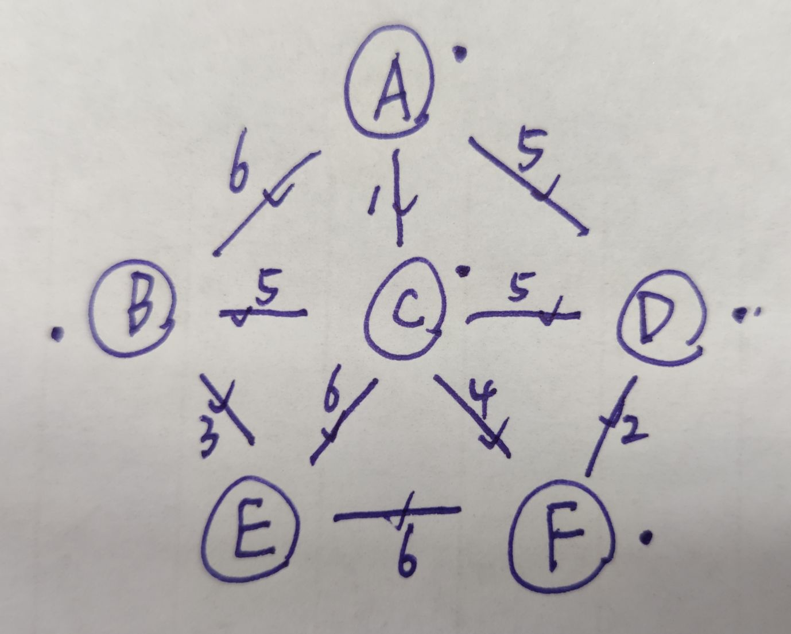
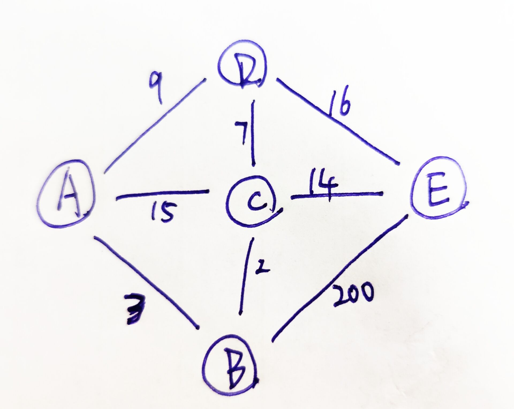

## 图

#### 无向图


```
A: C,D
B: C
C: A,B,D
D: A,C
```

> 把题中所给的图结构先转换成自己熟悉的结构，这样在做题的时候就会很熟悉，还会很稳

1. **性质**
   * 入度等于出度

2. **结构**

   ```java
   public class Graph {
       public HashMap<Integer, Node> nodes;
       public HashSet<Edge> edges;
   
       public Graph() {
           nodes = new HashMap<>();
           edges = new HashSet<>();
       }
   }
   
   public class Edge {
       //权值
       public int weight;
       public Node from;
       public Node to;
   
       public Edge(int weight, Node from, Node to) {
           this.weight = weight;
           this.from = from;
           this.to = to;
       }
   }
   
   public class Node {
       //节点的值
       public int value;
       //入度
       public int in;
       //出度
       public int out;
       //从该节点发散出去的点集合，即从该点指向的别的点
       public ArrayList<Node> nexts;
       //哪些边属于自己，即哪些边的屁股对着自己
       public ArrayList<Edge> edges;
   
       public Node(int value) {
           this.value = value;
           in = 0;
           out = 0;
           nexts = new ArrayList<>();
           edges = new ArrayList<>();
       }
   }
   ```

   >    在图中，nodes对应的哈希表结构可以换成数组，因为有时候给定的城市编号都不会太大，下标直接对应node，数组的直接寻址会更快一点

3. **构造图结构**

   ```java
       public static Graph createGraph(int[][] matrix) {
           Graph graph = new Graph();
           for (int i = 0; i < matrix.length; i++) {
               Integer from = matrix[i][0];
               Integer to = matrix[i][1];
               Integer weight = matrix[i][2];
               if (!graph.nodes.containsKey(from)) {
                   graph.nodes.put(from, new Node(from));
               }
               if (!graph.nodes.containsKey(to)) {
                   graph.nodes.put(to, new Node(to));
               }
               Node fromNode = graph.nodes.get(from);
               Node toNode = graph.nodes.get(to);
               fromNode.out++;
               toNode.in++;
               Edge edge = new Edge(weight, fromNode, toNode);
               fromNode.edges.add(edge);
               fromNode.nexts.add(toNode);
               graph.edges.add(edge);
           }
           return graph;
       }
   ```

* **宽度优先遍历** （一队一set）

    ```ACBDE || ABCDE || ADCBE 都是宽度优先遍历```

  1. **流程**

     定义一个队列和一个`hashset` ，初始化时A入队入set。

     出队，元素为A，对A的`nexts`遍历，`nexts`中有三个节点B C D，查看B是否在set中，不在，那么入队入set。查看C是否在set中，不在，入队入set，D同理，此时队里是D C B，set 里是 A B C D

     此next遍历结束，队伍不空，便继续出队B，发现B的`nexts`中的A在set中已经存在了，所以A就不set入队了

     > 这里就可以看出来set的作用，set使得这个图可以遍历完，不会进入循环状态

  2. **代码实现**

     ```java
     	public static void BFS(Node node) {
             if (node == null) {
                 return;
             }
             LinkedList<Node> queue = new LinkedList<>();
             HashSet<Node> set = new HashSet<>();
             queue.add(node);
             set.add(node);
             while (!queue.isEmpty()) {
                 node = queue.poll();
                 System.out.println(node.value);
                 for (Node n : node.nexts) {
                     if(!set.contains(n)){
                         queue.add(n);
                         set.add(n);
                     }
                 }
             }
         }
     ```

* **深度优先遍历**（一栈一set）

   ```A -> B -> C -> D -> E```

  1. **流程**

     初始化：A入栈入set

     ​	出栈节点为A，处理A的`nexts`，处理到一个节点B发现它不在set里面，说明它没被遍历到过，那么就从B开始往下面找到底，但是这时A的其他`nexts`还没遍历完，所以再把A压回栈，然后B节点入栈入set，处理B。B的`nexts`A在set里面有，所以B结束，栈里还有A。

     ​	A出栈，重新处理`nexts`，B在set里有了，然后搞C，再A入栈，然后C入栈入set，处理C...

     > 因为入set的时候就意味着这个节点已经处理完了，所以可以处理这个节点了，输出值之类的或者其他操作

  2. **代码实现**

     ```java
     	public static void dfs(Node node) {
             if (node == null) {
                 return;
             }
             Stack<Node> stack = new Stack<>();
             HashSet<Node> set = new HashSet<>();
             stack.push(node);
             set.add(node);
             System.out.println(node.value);
             while (!stack.empty()) {
                 node = stack.pop();
                 for (Node next : node.nexts) {
                     if (!set.contains(next)) {
                         set.add(next);
                         System.out.println(next.value);
                         stack.push(node);
                         stack.push(next);
                         break;//*
                     }
                 }
             }
         }
     ```

     > 注意在for循环里面，如果找到了没有遍历过的节点（即set中不存在的节点），就要把之前stack中pop的节点重新放回去，然后！！`break`跳出对其他next节点的检查，不要忘记`break`！

* **拓扑排序**

  1. **问题描述**

     比如编译时需要的依赖包：A依赖B，C，D，B依赖C，D，E，那么图的结构如下

     

     * 找到入度为0的节点，然后删除它以及它的全部影响。
     * 再找到入度为0的节点，然后删除它以及它的全部影响。
     * 直到图中没有节点

  2. **例题**

     

  3. **流程**

     * 建立一个key为node，value为in（入度）的map，以及入度为0的node队列

     * 遍历给的图中的所有节点，将信息写入map中，并将入度为0的点入队。

     * 出队一个节点（就相当于这个节点已经处理完了），然后删除这个节点的影响

     * 遍历这个出队节点的`nexts`，把它们在map中的对应入度--

     * 判断减完之后这个节点的入度是否为0，是的话把它入队

     * 循环，直到队列为空

       > 注：新建的节点对应入度的map，是为了保留原来图不变，不能直接在node的节点上更改数据

  4. **代码实现**

     ```java
     	public static List<Node> sortedTopology(Graph graph) {
             LinkedList<Node> zeroInNodes = new LinkedList<>();
             HashMap<Node, Integer> map = new HashMap<>();
             for (Node node : graph.nodes.values()) {
                 map.put(node, node.in);
                 if (node.in == 0) {
                     zeroInNodes.add(node);
                 }
             }
             ArrayList<Node> res = new ArrayList<>();
             while (!zeroInNodes.isEmpty()) {
                 Node node = zeroInNodes.poll();
                 res.add(node);
                 for (Node n : node.nexts) {
                     int in = map.get(n) - 1;
                     map.put(n, in);
                     if (in == 0) {
                         zeroInNodes.add(n);
                     }
                 }
             }
             return res;
         }
     ```

     > 将`hashMap`中key对应的所有value放到一个集合里面：```map.values()```
  
* **最小生成树**

  **K算法**

  1. **流程**

     ​	每次取权值最小的边，然后检查加入这条边后，是否形成环，如果不形成环，则要这条边，否则再继续找下一条最小权值边，直到所有的边都处理完成。

     

  2. **工具代码**（伪并查集）

     ```java
     	public static class MySets {
             //每一个点所在的集合，所以是node对应node的List
             public HashMap<Node, List<Node>> setMap;
     
             public MySets(List<Node> nodes) {
                 for (Node cur : nodes) {
                     ArrayList<Node> list = new ArrayList<>();
                     list.add(cur);
                     setMap.put(cur, list);
                 }
             }
     
             //内存地址相同就是一个集合，否则就不是
             public boolean isSameSet(Node from, Node to) {
                 List<Node> fromSet = setMap.get(from);
                 List<Node> toSet = setMap.get(to);
                 return fromSet == toSet;
             }
     
             public void union(Node from, Node to) {
                 List<Node> fromSet = setMap.get(from);
                 List<Node> toSet = setMap.get(to);
                 for (Node toNode : toSet) {
                     fromSet.add(toNode);
                     setMap.put(toNode, fromSet);//*
                 }
             }
         }
     ```

     > 注：*这里的意思是，把to点加到from所在的集合里面，然后把to的集合直接指向from的内存地址，不要to之前的那个集合了。

  3.  **K算法实现**

     ```java
     	public static Set<Edge> kruskalMST(Graph graph) {
             MySets mySets = new MySets((List<Node>) graph.nodes.values());
             PriorityQueue<Edge> queue = new PriorityQueue<Edge>((a, b) -> a.weight - b.weight);
             Set<Edge> res = new HashSet<>();
             while (!queue.isEmpty()) {
                 Edge edge = queue.poll();
                 if (!mySets.isSameSet(edge.from, edge.to)) {
                     mySets.union(edge.from, edge.to);
                     res.add(edge);
                 }
             }
             return res;
         }
     ```

  **P算法**（适用于无向图）

  

  1. **流程**

     ​	首先，随机选取A点开始，那么A的临边AB AC AD都变为可选边，在所有的可选边中，找一条权值最小的AC，那么C点选取完毕。

     ​	C点的邻接边CB，CA,  CD, CD, CE,都加入可选边集合，再从所有的可选边中找一条权值最小的CF，F点选取完毕。依次类推到D。

     ​	然后有三条权值都为5的边，选取CB因为B点没有被选取，然后再走上面的流程。

     ​	最后结果为```ACFDBE```

  2. **代码流程**

     这种算法不是一个一个点进来然后连通的，可能是两个集团然后突然有一条边，把两个集团连接起来。

     * 定义一个队列和一个节点的set

     * 随机选取一点，然后把这个点的所有边按权值放入小根堆队列里面，再把这个点放入set里面。

     * poll队列，判断出队的边e1的to节点在不在set里面，在的话说明该点已经处理过。

     * 不在set里面的话，把e1的to节点的边放入小根堆队列里面，再把它放到set里面。（这里面可能有放入重复边的情况发生，但是不影响，因为后面会有set判断）

       > ​	注意：这种情况只针对连通图，如果该图不连通的话，就要把随机选点的那一步，改为遍历整个图的所有节点。当处理完一个连通图后，这个连通图的所有节点都已经加入的set里面，那么遍历到这个节点的时候就会直接跳过。直到遍历到第一个不在这个连通图中的节点。

       

  3. **代码实现**

     ```java
     	public static Set<Edge> prim(Graph graph) {
             if (graph == null) {
                 return null;
             }
             Set<Edge> res = new HashSet<>();
             HashSet<Node> set = new HashSet<>();
             PriorityQueue<Edge> queue = new PriorityQueue<>(Comparator.comparingInt(a -> a.weight));
             for (Node node : graph.nodes.values()) {
                 if (!set.contains(node)) {
                     set.add(node);
                     queue.addAll(node.edges);
                     while (!queue.isEmpty()) {
                         Edge se = queue.poll();
                         if (!set.contains(se.to)) {
                             set.add(se.to);
                             res.add(se);
                             queue.addAll(se.to.edges);
                         }
                     }
                 }
             }
             return res;
         }
     ```

  **Dijkstra算法**

  > 可以有权值为负值的边，但不能有权值和为负数的环。因为有的话，那么每转一圈，权值就会变小，那么就会一直循环。

  1. **流程**

     

     规定出发点，然后得到出发点到剩余其他点的最短路径的长度（矩阵）  

     * 规定出发点为A，首先初始化矩阵

       |      |  A   |  B   |  C   |  D   |  E   |
       | :--: | :--: | :--: | :--: | :--: | :--: |
       |  A   |  0   | max  | max  | max  | max  |

     * 然后从里面找一条最短的，即A到A=0，发现从A经过A到其他点的距离，从而更新矩阵。

       |      |  A   |  B   |  C   |  D   |  E   |
       | :--: | :--: | :--: | :--: | :--: | :--: |
       |  A   |  0   |  3   |  15  |  9   | max  |

     * 此时表格上面的A点已经用完了，不再使用它，重新找表格里面最小的路径，为A到B，然后把B作为中间节点，查看A到其他节点如果通过B的话路径会不会变短

       |      |  A   |  B   |  C   |  D   |  E   |
       | :--: | :--: | :--: | :--: | :--: | :--: |
       |  A   |  0   |  3   |  5   |  9   | 203  |

     * 然后B也用完了，更新后再找一个最小的为A到C，再更新

       |      |  A   |  B   |  C   |  D   |  E   |
       | :--: | :--: | :--: | :--: | :--: | :--: |
       |  A   |  0   |  3   |  5   |  9   |  19  |

     * 直到最后一个点用完，那么A到其他节点的最短距离就更新完成了

  2. **代码流程**

     * ​	建立一个map，key为Node，value为权重。在这个map里面，起点已经固定了，key的意思就是起点到node，value就是起点到node的权重，然后把起点到起点距离为0写进去。如果map中没有目标节点，说明起点到目标节点的距离为无穷大。
     * 建立一个set，里面放的是被选择过的点。
     *    获取当前表格中权值最小的目的节点。然后遍历目的节点的所有边，比较并且更新路径长度到map中，如果map里面没有这个目标点，说明起点到目标点的距离为正无穷，不用比较直接加就行。
     * 遍历过后，这个节点就用过了，那么就把这个节点放到set里面。
     * 在map中再找一个路径最短且没有被选择过节点，把它设置为minNode，直到minNode为空，就退出循环。

  3. **代码实现**

     ```java
     	public static Map<Node, Integer> dijkstra(Node head) {
             if (head == null) {
                 return null;
             }
             HashMap<Node, Integer> distanceMap = new HashMap<>();
             distanceMap.put(head, 0);
             HashSet<Node> touchedSet = new HashSet<>();
             Node minNode = head;
             while (minNode != null) {
                 int distance = distanceMap.get(minNode);
                 for (Edge edge : minNode.edges) {
                     if (!distanceMap.containsKey(edge.to)) {
                         distanceMap.put(edge.to, distance + edge.weight);
                     } else {
                         distanceMap.put(edge.to, Math.min(distanceMap.get(edge.to), distance + edge.weight));
                     }
                 }
                 touchedSet.add(minNode);
                 minNode = findMinNode(distanceMap, touchedSet);
             }
             return distanceMap;
         }
     
         private static Node findMinNode(HashMap<Node, Integer> distanceMap, HashSet<Node> touchedSet) {
             int minDistance = Integer.MAX_VALUE;
             Node minNode = null;
             for (Map.Entry<Node, Integer> entry : distanceMap.entrySet()) {
                 if (entry.getValue() < minDistance && !touchedSet.contains(entry.getKey())) {
                     minDistance = entry.getValue();
                     minNode = entry.getKey();
                 }
             }
             return minNode;
         }
     ```

* **改进Dijkstra**

  1. **思路**

     因为每次使用完一个节点过后，都要在更新过路径长度的表格中，再找出一个最小的路径长度的点。因此可以使用小根堆。

     > 系统提供的堆结构，不支持在已经形成的堆结构中，改变一个节点的值，再调整位置。所以要自己实现堆结构。

     