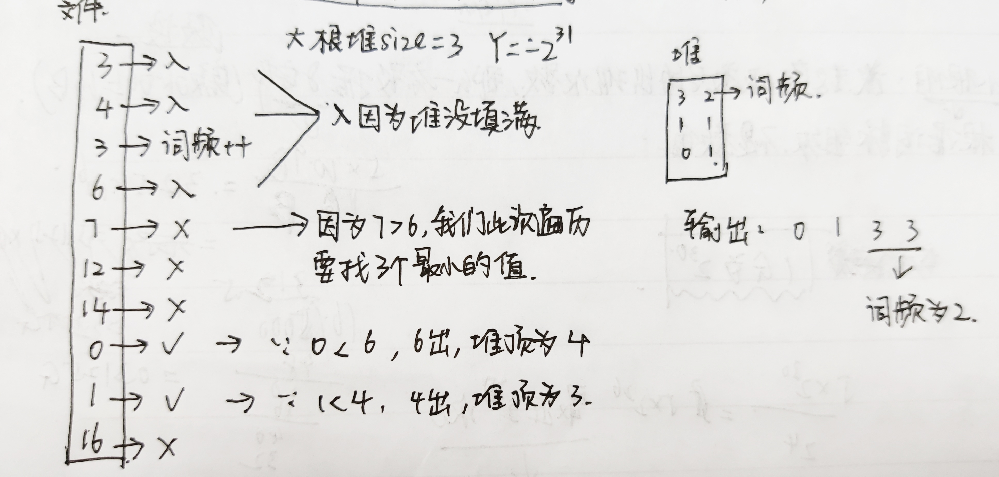

## 大数据问题

> 解题技巧：
>
> 1. 哈希函数可以把数据按照种类均匀分流
> 2. 布隆过滤器用于集合的建立与查询，并可以节省大量空间
> 3. 一致性哈希解决数据服务器的负载管理问题
> 4. 利用并查集结构做岛问题的并行计算
> 5. 位图解决某一范围上数字的出现情况，并可以节省大量空间
> 6. 利用分段统计思想，并进一步节省大量空间
> 7. 利用堆、外排序来做多个处理单元的结果合并

* **例一**

  1. **问题描述**

     32位无符号整数的范围是0~4294967295，现在有一个包含40亿个无符号整数的文件，所以整个范围中必然存在没出现过的数。可以使用最多`1GB`内存，怎么找到所有未出现的数?

  2. **问题分析**

     使用位图，40亿长度的bit数组。

  3. **进阶问题**

     内存限制为`3KB`，但是只需找到一个没出现过的数即可。

     * 现在全部利用`3KB`的内存空间，将`3KB`申请一个最大长度且长度为2的n次方的int数组，那么数组长度计算如下：即512

       > `3KB / 4B = 750 > 521 = 2^9`，所以申请长度为512的int数组，长度为2的n次方的目的是，把32位无符号整数的范围分组，好让分组时可以被整除

     * 把0~2^32-1范围上的数分成512份，每份负责的范围步长都一样，负责的步长为`2^32 / 2^9 = 2^23`所以int[0]负责看0~2^23-1范围上的数是不是都出现了，这里就算重合导致认为都出现了也没关系，因为肯定有一组数量不够，我们找到一组就可以了。

     * 对所有的数遍历，然后对每个数字除以2^23，余数就是下标位置，该下标位置++

     * 发现数组中的一个元素值不够2^32个，说明这个范围里面，有数字没有出现

     * 再次利用`3KB`，将2^23次方这个步长分组，回到最开始的那一步，然后再找再找

     * 最后这个范围小于等于24000个数的时候，那么把`3KB`申请长度为24000的比特数组，再过最后一遍文件即可。

     > 注意int占4个字节，就是32位，都可表示

     > 如果要求用有限个变量的话依然可以完成这个问题，二分二分二分
  
* **例二**

  1. **问题描述**

     有一个包含100亿个URL的大文件，假设每个URL占用`64B`，请找出其中所有重复的URL

  2. **解决方法**

     * 使用布隆过滤器，在遍历URL的时候，边添加边查询，有重复的时候就把重复的URL保存到文件中，但是这种方式存在失误率
     * 使用hash分流到多个小文件`url -> hash -> out -> %m -> 多个小文件`，然后在每个小文件中统计重复的词汇，再汇总在一起。

  3. **进阶问题**

     某公司一天的用户搜索词汇是百亿数据量，请设计一种求出每天热门`Top`100词汇的可行方法

     1. 将整个大文件通过hash分流到多个小文件，然后在小文件中统计词频出现次数，并以出现次数形成大根堆

     2. 将每个小文件的大根堆堆顶元素拿出来，单独形成一个大根堆，成为总堆

     3. 在这个总堆里面取堆顶，即为最大，然后看现在取出的这个堆顶的词汇是哪个小文件统计出来的，则把这个小文件里面的堆头删了，然后小文件重新形成大根堆，再取新的这个大根堆里面的堆顶放到总堆里面，再拿出总堆的堆顶...

        > 堆调整的时间复杂度是`O(logN)`

* **例三**

  1. **问题描述**

     32位无符号整数的范围是`0~4294967295`，现在有40亿个无符号整数，可以使用最多`1GB`的内存，找出所有出现了两次的数

  2. **解决方法**

     32位无符号整数的范围是0~2^32-1，一共2^32次方个数，可以使用两位bit信息来表示，对一个数来说：00表示出现0次，01表示出现1次，10表示出现2次，11表示出现两次及以上。那么对于2^32个数来说，一共需要2^33个比特位来表示。

  3. **补充问题**

     可以使用最多`10KB`的内存，怎么找到这40亿个整数的中位数

     > 使用范围统计思想

     `10KB/4B = 2500 > 2048 = 2^11`  所以申请长度为2048的int数组，那么把0~2^32-1这个范围分成2048份，就相当于int数组上的每个数代表这个范围上的数的出现次数，一个`int`4字节32位，可以表示42亿个数，不用担心不够用。

     然后遍历大文件中的每个数，每次遍历时，让这个数对应范围上的代表值++，那么中位数就是求第20亿个数，可以通过前面的累加，看这个数在哪个范围上。

     然后再来。

* **例四**

  1. **问题描述**

     给`10G`的文件，里面都是有符号的整数，但是是乱序的，现在给`5G`的内存，要求输出一个有序的文件。

  2. **解决方法**

     

     当遍历完这一次时，将Y的值设置为3，即这次找到的最小值中，最大数，那么下次在遍历文件的时候，碰到小于等于3的数就直接跳过，然后再找三个，直到都处理完。

* **例五**

  1. **问题描述**

     

