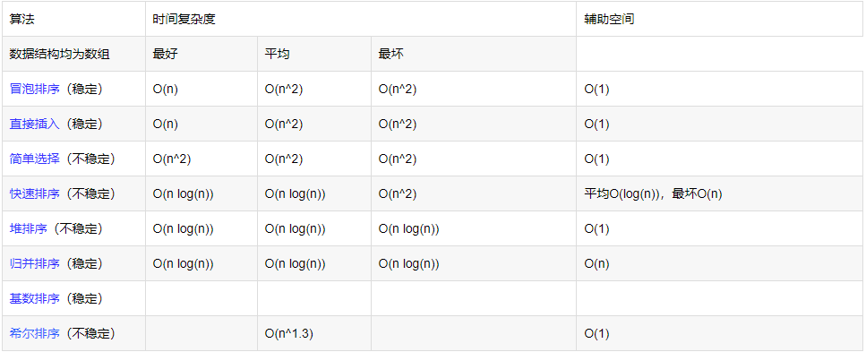

# 排序总结

### 复杂度以及稳定性



#### 选择排序

1. **思路**

   ​	遍历n次，每次遍历都找出最小的数，然后和数组中无序部分的第一个数交换位置。

   

2. **代码实现**

   ```java
   public static void selectSort(int[] arr) {
       if (arr == null || arr.length < 2) {
           return;
       }
       int min;
       for (int i = 0; i < arr.length - 1; i++) {
           min = i;
           for (int j = i + 1; j < arr.length; j++) {
               min = Math.min(arr[min], arr[j]) == arr[min] ? min : j;
           }
           swap(arr, min, i);
       }
   }
   
   private static void swap(int[] arr, int i, int j) {
       if (i == j) {
           return;
       }
       arr[i] = arr[i] ^ arr[j];
       arr[j] = arr[i] ^ arr[j];
       arr[i] = arr[i] ^ arr[j];
   }
   
   public static void main(String[] args) {
       int[] ints = RandomArray.generateRandomArray(20, 20);
       System.out.println(Arrays.toString(ints));
       selectSort(ints);
       System.out.println(Arrays.toString(ints));
   }
   ```

#### 冒泡排序

1. **思路**

   从前往后开始遍历，每次比较相邻两个数，谁大谁就右移，遍历一遍就相当于把最大的那个放到了最右边。每遍历一次搞定一个最大的，遍历（n-1）次

   > **冒泡是每次后面有序，选择是每次前面有序，所以注意二层循环的时候的边界条件**

   

2. **代码实现**

   ```java
   public static void bubbleSort(int[] arr) {
       if (arr == null || arr.length < 2) {
           return;
       }
       for (int i = 0; i < arr.length - 1; i++) {
           for (int j = 1; j < arr.length - i; j++) {
               if (arr[j - 1] > arr[j]) {
                   swap(arr, j - 1, j);
               }
           }
       }
       return;
   }
   
   private static void swap(int[] arr, int i, int j) {
       if (i == j) {
           return;
       }
       arr[i] = arr[i] ^ arr[j];
       arr[j] = arr[i] ^ arr[j];
       arr[i] = arr[i] ^ arr[j];
   }
   ```

#### 插入排序

1. **思路**

   使数组的左部分有序：0-0，0-1，0-2逐渐有序。每次将有序部分的下一个数，通过小冒泡的方式进到有序部分中。遍历n-1次

   > 和冒泡的不同之处在于：插入是从左到右由小变大的过程，冒泡是从右往左逐渐变小的过程。
   >
   > 插入排序是在小冒泡的时候，发现前面一个数已经比自己小了，就停下来不往前冒泡了。所以算是有记忆性的一种排序。
   >
   > **注意第二层遍历的时候，要判断停下来的条件，不要冒泡冒到数组头。**

   

2. **代码实现**

   ```java
   	public static void insertionSort(int[] arr) {
           if (arr == null || arr.length < 2) {
               return;
           }
           for (int i = 1; i < arr.length; i++) {
               for (int j = i; j >= 1 && arr[j] < arr[j - 1]; j--) {
                   swap(j, j - 1, arr);
               }
           }
       }
   
       private static void swap(int j, int i, int[] arr) {
           arr[i] = arr[i] ^ arr[j];
           arr[j] = arr[i] ^ arr[j];
           arr[i] = arr[i] ^ arr[j];
       }

#### 希尔排序

1. **思路**

   主体思想还是插入排序。将整个数组分组，但是这个组不是连续的，是固定间隔的，如下图：

   

   各个元素之间的间隔称为步长step，初始步长为数组的一半，在每个分组内进行插入排序。

   进行完这次插入排序后，将步长变为原来的1/2，分组，然后组内排序

2. **代码实现**

   ```java
   	public static void shellSort(int[] arr) {
           if (arr == null || arr.length < 2) {
               return;
           }
           for (int step = arr.length / 2; step > 0; step /= 2) {
               for (int i = step; i < arr.length; i++) {
                   for (int j = i; j - step >= 0 && arr[j] < arr[j - step]; j -= step) {
                       swap(j, j - step, arr);
                   }
               }
           }
       }
   
       private static void swap(int j, int i, int[] arr) {
           if (i == j) {
               return;
           }
           arr[i] = arr[i] ^ arr[j];
           arr[j] = arr[i] ^ arr[j];
           arr[i] = arr[i] ^ arr[j];
       }
   ```

   > 新建变量 j = i

#### 归并排序

1. **思路**

   从mid位置断开，左边好排序，右边排好序，然后左边右边连在一起，再merge一下整体排好序。

   用递归的思路来进行排序的，递归的终止条件，是给出的数组的左边界大于等于右边界。

   merge时，开辟一个等同于两个子递归长度和的数组空间help[]（和参数的左右边界相同），用两个指针分别指向两个子数组的第一个位置，比较两个指针位置的数谁小，小的写到help里面，再往右移动写的那个指针。

   直到其中一个指针越界了，把另一个指针后面的数，拷贝到help剩下的空间里面。最后把help拷贝到原数组对应的位置上去。

   > 注意递归的终止条件：数组为null或者左边界大于等于右边界。因为如果传入空数组的话，L=0,R=-1。

   

   

2. **代码实现**

   ```java
   	private static void mergeSort(int[] arr, int L, int R) {
           //空数组的时候，l为0，r为-1
           if (arr == null || L >= R) {
               return;
           }
           //防止R+L整数越界，而且位运算更快
           //这里注意加括号，因为算数运算的优先级要高于移位运算，移位运算高于位运算
           int mid = L + ((R - L) >> 1);
           mergeSort(arr, L, mid);
           mergeSort(arr, mid + 1, R);
           merge_r(arr, L, mid, R);
       }
   
       private static void merge_r(int[] arr, int l, int mid, int r) {
           int[] help = new int[r - l + 1];
           int p1 = l, p2 = mid + 1;
           int index = 0;
           while (p1 <= mid && p2 <= r) {
               help[index++] = arr[p1] < arr[p2] ? arr[p1++] : arr[p2++];
           }
           while (p1 <= mid) {
               help[index++] = arr[p1++];
           }
           while (p2 <= r) {
               help[index++] = arr[p2++];
           }
           for (int i = l, j = 0; j < help.length; i++, j++) {
               arr[i] = help[j];
           }
       }
   ```

   #### 快速排序

   1. **前提**

      荷兰国旗问题

      * **问题描述**

        给定一个flag的值，让数组的左边部分小于flag，中间部分等于flag，右边部分大于flag

      * **解决方法**

        ​	划分两个区域，初始化左边小于flag区域的右边界p1为-1，右边大于flag区域的左边界p2为数组长度，中间等于flag区域的左边界i为 p1+1。

        ​	从i开始遍历数组，

        	1. **如果该值小于flag**，把该位置和p1的右边第一个位置交换（这里有可能出现 i=j 的情况，运用位运算交换的时候要注意判断，否则会将该值变为0），然后把小于flag的区域变大，即p1++，此时 arr[i]  的位置已经看过了，所以要i++；
        	1. **如果该值等于flag**，继续往下遍历，i++;
        	1. **如果该值大于flag**，交换i的位置和p2左边的第一个位置，然后把大于flag的区域变大，即p2--；**注意：此时i位置的值是新换过来的，所以不用i++；**

        > 终止条件：i遍历到了大于flag的前一个位置，即 i=p2

      * **代码实现**

      ```java
       	public static void netherlandsFlag(int[] arr, int flag) {
              if (arr == null || arr.length < 2) {
                  return;
              }
              int p1 = -1, p2 = arr.length, i = 0;
              while (i < p2) {
                  if (arr[i] < flag) {
                      swap(arr, i++, ++p1);
                  } else if (arr[i] > flag) {
                      swap(arr, i, --p2);
                  } else {
                      i++;
                  }
              }
          }
          
          private static void swap(int[] arr, int a, int b) {
              if (a == b) {
                  return;
              }
              arr[a] = arr[a] ^ arr[b];
              arr[b] = arr[a] ^ arr[b];
              arr[a] = arr[a] ^ arr[b];
          }
      ```

      

   2. **思路**

   ​	首先随机取得数组中的一个下标，把这个位置和最后一个位置相交换。再将整个数组通过partition来一遍荷兰国旗问题，范围为去掉数组的最后一位。flag值就是数组的最后一个位置的值（也就是随机取得的下标位置的值）。然后荷兰过后，把数组的最后一位和大于flag的第一位（右半部分的第一个位置）交换，于是这是，数组就变成了左边部分<flag，中间部分等于flag，右边部分大于flag的结构了。

   ​	把上述的荷兰国旗问题返回一个只包含两个元素的数组，即等于flag的左右边界。然后把小于flag部分再进行快排，大于flag部分也进行快排。

   3. **代码实现**

   ```java
   	private static void quickSort(int[] arr, int L, int R) {
           if (arr == null || L >= R) {
               return;
           }
           int index = L + (int) (Math.random() * (R - L + 1));
           swap(arr, index, R);
           int[] ints = netherLandFlag(arr, L, R);
           quickSort(arr, L, ints[0] - 1);
           quickSort(arr, ints[1] + 1, R);
       }
   
       private static int[] netherLandFlag(int[] arr, int l, int r) {
           int flag = arr[r];
           int p1 = l - 1, p2 = r, i = l;
           while (i < p2) {
               if (arr[i] < flag) {
                   swap(arr, i++, ++p1);
               } else if (arr[i] > flag) {
                   swap(arr, i, --p2);
               } else {
                   i++;
               }
           }
           swap(arr, r, p2);
           return new int[]{p1 + 1, p2 - 1};
       }
   
   	private static void swap(int[] arr, int i, int j) {
           if (i == j) {
               return;
           }
           arr[i] = arr[i] ^ arr[j];
           arr[j] = arr[i] ^ arr[j];
           arr[i] = arr[i] ^ arr[j];
       }
   ```

   #### 堆排序

   1. **思路**

      首先将整个数组形成一个大根堆，遍历数组中的元素进行heapInsert操作。则数组的第一个数为最大值，将头与尾的位置交换。

      现在这个大根堆的第一个位置的值不对，要让它到它属于的位置上去，这时调用函数heapify；

      

      * **完全二叉树**

        1. 从上到下，从左至右依次填这颗树，子节点可以不满，按顺序来就行。

        2. 设父节点的序号为x，那它的左子树的序号为 ```2x + 1``` ，右子树的序号为 ```2x + 2```;

        3. 设一个节点的序号为y，那它的父节点的序号为 ```(y - 1) / 2```;（顶点也适用：-1/2=0）

        4. 最后一个元素所在的层数 f 为``` log2 ^ arr.length``` 即：```(int)(Math.log(arr.lenght) / Math.log(2))```

        5. 去掉最后一层是一个满二叉树，那么在这个满二叉树中最后一个元素在数组中的下标为```2 ^ f - 2```

           即```(int) (Math.pow(2, f) - 2)```

      * **heapInsert（向上插入）**

        把当前位置节点的值和自己的父节点的值作比较，若小则交换位置，并且index = (index-1)/2

        ```java
        	private static void heapInsert(int[] arr, int index) {
                while (arr[index] > arr[(index - 1) / 2]) {
                    swap(index, (index - 1) / 2, arr);
                    index = (index - 1) / 2;
                }
            }
        ```

      * **heapify（向下插入）**

        先找到自己左右节点中值最大的那一个（下面的它不是指自己，是最大的子节点，主角是父节点）

        **若它的值比父节点大**，交换这两个位置，index变为值大的那个子节点的序号。然后继续重复这个操作，直到它的值比两个子节点都大，或者再没有子节点了。

        **若它的值比父节点小**，break;

        ```java
        	private static void heapify(int[] arr, int index, int heapSize) {
                int left = index * 2 + 1;
                while (left < heapSize) {
                    int largest = left + 1 < heapSize && arr[left + 1] > arr[left]
                            ? left + 1 : left;
                    largest = arr[index] > arr[largest] ? index : largest;
                    if (largest == index) {
                        break;
                    }
                    swap(index, largest, arr);
                    index = largest;
                    left = index * 2 + 1;
                }
            }
        ```

   2. **代码实现**

      ```java
       public static void hs(int[] arr) {
              if (arr == null || arr.length < 2) {
                  return;
              }
            	// for (int i = 0; i < arr.length; i++) {
            	//     hi(arr, i);
            	//  }
              //计算出满二叉树的最后一个节点的下标
              int f = (int) (Math.log(arr.length) / Math.log(2));
              for (int i = (int) (Math.pow(2, f) - 2); i >= 0; i--) {
                  heapify(arr, i, arr.length);
              }
              swap(0, arr.length - 1, arr);
              int heapSize = arr.length - 1;
              while (heapSize > 1) {
                  heapify(arr, 0, heapSize);
                  swap(0, --heapSize, arr);
              }
          }
      ```

      

      > 注释的部分为遍历数组，然后对每个元素进行heapInsert
      >
      > 改进后为，从去掉最后一排之后的 满二叉树的最后一个位置的下标开始，向前遍历。
      >
      > 注意要遍历到 0 的位置，heapSize要一直为arr.length

      #### 计数排序
      
      1. **思路**
      
         新申请数组，下标当原数组的值。
      
         	* 对有限个大于等于0的数进行排序，申请一个长度为，原数组中（最大值+1），
         	* 遍历整个原数组，遍历到的位置的值就是新数组的下标，然后在新数组中该下标位置的值+1；
         	* 再遍历新数组，取该位置的下标填到原数组的第一个位置上去
         	* 新数组下标对应的值--，原数组往后移一个，直到新数组下标对应值减到0。
      
         
      
         
      
      2. **代码实现**
      
         ```java
         	public static void countingSort(int[] arr) {
                 if (arr == null || arr.length < 2) {
                     return;
                 }
                 int max = findMax(arr);
                 int[] bucket = new int[max + 1];
                 for (int i : arr) {
                     bucket[i]++;
                 }
                 int index = 0;
                 for (int i = 0; i < bucket.length; i++) {
                     while (bucket[i] > 0) {
                         arr[index++] = i;
                         bucket[i]--;
                     }
                 }
             }
         
             private static int findMax(int[] arr) {
                 int max = arr[0];
                 for (int i = 1; i < arr.length; i++) {
                     max = Math.max(max, arr[i]);
                 }
                 return max;
             }	
         ```
      
         #### 基数排序
      
         1. **思路**
      
            按照基数，即进制来排序。以十进制为例
      
            * ​	首先以数组中最大的那个数的位数为基准（比如111是数组中最大的数，那么位数就是3），
      
              然后不到三位的左边补齐0
      
            * 建立一个长度为基数长度10的数组count，和一个和原数组长度相同的辅助数组help
      
            * 遍历原数组，先取遍历到的数的个位，在count对应的下标位置++
      
            * 然后从第二个数开始处理一下count数组，```count[i] += count[i-1] ```
      
            * 再从右往左遍历原数组，该数的个位 i，再取count中的count[i]，写到help数组里面下标为count[i]的位置上去，然后count[i]--
      
              > 注意是从原数组右边开始遍历，因为在二维数组中，是从左往右先入桶，出桶顺序也是从左往右。那么通过这种方式，从右边遍历可以使它赋值在最后面的位置
      
            * 如此一来个位就排好了，然后循环直到最高位排完
      
              
      
         2. **代码实现**
      
            ```java
            	public static void radixSort(int[] arr, int L, int R, int digit) {
                    final int radix = 10;
                    int i = 0, j = 0;
                    int[] help = new int[R - L + 1];
                    for (int d = 1; d <= digit; d++) {
                        int[] counts = new int[radix];
                        for (i = L; i <= R; i++) {
                            j = getDigit(arr[i], d);
                            counts[j]++;
                        }
                        for (i = 1; i < counts.length; i++) {
                            counts[i] += counts[i - 1];
                        }
                        for (i = R; i >= L; i--) {
                            j = getDigit(arr[i], d);
                            help[counts[j] - 1] = arr[i];
                            counts[j]--;
                        }
                        for (i = 0; i < help.length; i++) {
                            arr[i + L] = help[i];
                        }
                    }
                }
            
                private static int getDigit(int num, int digit) {
                    return (num / (int) Math.pow(10, digit - 1)) % 10;
                }
            
                private static int getMaxDigit(int[] arr) {
                    int max = arr[0];
                    for (int i = 1; i < arr.length; i++) {
                        max = Math.max(max, arr[i]);
                    }
                    int res = 0;
                    while (max != 0) {
                        res++;
                        max /= 10;
                    }
                    return res;
                }
            ```
      
            > 注意count数组要写在循环里面，每次digit加一的时候都要重新生成count数组，如果写在外面，count就不能清空了。
            >
            > 可以在循环外面建立两个不需要记忆的辅助变量，i和j，这样会看上去很方便易懂。
