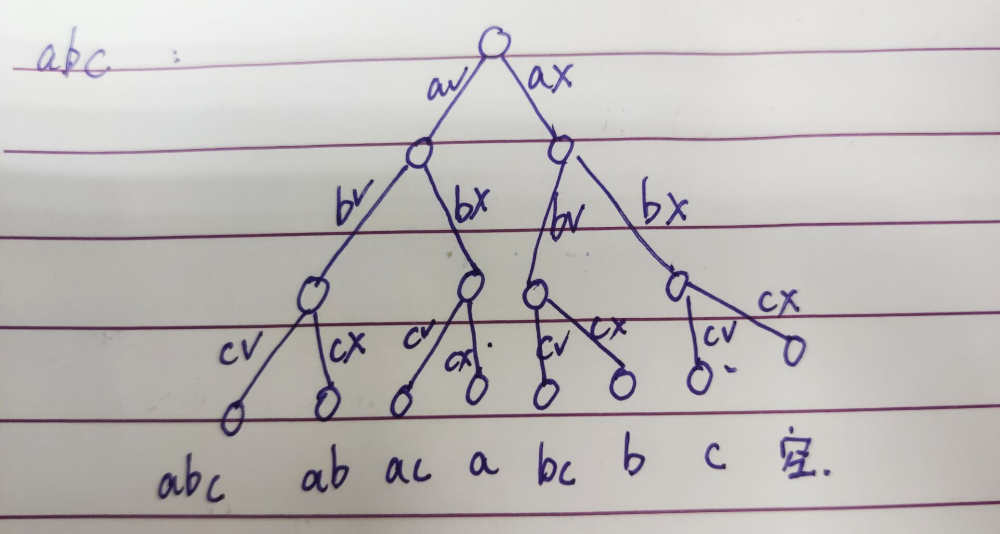

## 暴力递归（尝试）

### 流程

1. 把问题转化为规模缩小了的同类问题的子问题
2. 有明确的不需要继续进行递归的条件（base case）
3. 有得到了子问题结果的决策过程
4. 不记录每一个子问题的解

> 不要全局想，只想当前局部的操作，如果当前局部的操作是对的，那么整体一定是对的

#### 汉诺塔问题

1. **问题描述**

   略

2. **流程**

   * 把第N-1个圆盘和它上面的圆盘从左移到中
   * 把第N个圆盘从左移到右
   * 把中间的全部移到右

3. **代码实现**

   ```java
   	public static void hanoi(String start, String end, String other, int i) {
           if (i == 1) {
               System.out.println("move 1 from " + start + " to " + end);
               return;
           }
           hanoi(start, other, end, i - 1);
           System.out.println("move " + i + " from " + start + " to " + end);
           hanoi(other, end, start, i - 1);
       }
   ```

   >  注意在`baseCase`里面要记得return，要不然就会走下面的代码了

   #### 找到所有子串

   1. **问题描述**

      打印一个字符串的全部子序列，包括空字符串

   2. **例子&流程分析**

      

      > 对号代表要，叉号代表不要

   3. **前提知识**

      ```java
      	char[] chars = {'a', 'b', 0, 'c'};
          System.out.println(String.valueOf(chars));//abc
      ```

      > 将字符数组中的一个值设置为0，那么在把它转回String的时候就跳过那个设置为0的值。如上，打印结果为`abc`

   4. **代码实现**

      ```java
      	public static void process2(char[] chars, int i) {
              if (i == chars.length) {
                  System.out.println(String.valueOf(chars));
                  return;
              }
              process2(chars, i + 1);
              char temp = chars[i];
              chars[i] = 0;
              process2(chars, i + 1);
              chars[i] = temp;
          }
      ```

   #### 打印一个字符串的全部排列

   1. **问题描述**

      字符串的全排列

   2. **代码实现**

      ```java
      	public static void permutation(String word) {
              if (word == null || word.isEmpty()) {
                  return;
              }
              char[] chars = word.toCharArray();
              process(chars, 0);
          }
      
          private static void process(char[] chars, int i) {
              if (i == chars.length) {
                  System.out.println(String.valueOf(chars));
                  return;
              }
              for (int j = i; j < chars.length; j++) {
                  swap(chars, i, j);
                  process(chars, i + 1);
                  swap(chars, i, j);
              }
          }
      
          private static void swap(char[] chars, int i, int j) {
              if (i == j) {
                  return;
              }
              char tmp = chars[i];
              chars[i] = chars[j];
              chars[j] = tmp;
          }
      ```

      > 这里有一个bug，当字符串中有两个相同的字符时，往后交换位置的时候，如果交换到和自己相同的字符，就会打印重复的字符串，因此做出如下改进：

   3. **改进版**

      解决字符串中含有重复字符，打印重复排列的bug

      * **解决思路**

        ​	建立一个visit数组，类型为boolean，长度为26（即英文字母的长度）。每次交换的时候，把要交换的字符在数组中对应的位置置为true，代表这个字符已经访问过了，那么下次再遇到这个字符的时候就不换了。

      * **代码实现**

        ```java
        	private static void process(char[] chars, int i) {
                if (i == chars.length) {
                    System.out.println(String.valueOf(chars));
                    return;
                }
                boolean[] visit = new boolean[26];
                for (int j = i; j < chars.length; j++) {
                    if (!visit[chars[j] - 'a']) {
                        swap(chars, i, j);
                        visit[chars[j] - 'a'] = true;
                        process(chars, i + 1);
                        swap(chars, i, j);
                    }
                }
            }
        ```

        #### 最大纸牌值问题

        1. **问题描述**

           ​	两个聪明绝顶的人（意思就是选择一定是正确的），选择纸牌，只能选纸牌的最左边或者最右边，然后比较谁最后的总和大。

        2. **流程分析**

           * 先手函数：

             ​	`value1`：先手拿左牌，加上后手拿，拿完左牌的纸牌堆

             ​	`value2`：先手拿右牌，加上后手拿，拿完右牌的纸牌堆

             ​	返回两者最大值

           * 后手函数：

             ​	`value1`：对面先手拿左牌，那我就是先手拿剩余的

             ​	`value2`：对面先手拿右牌，那我就是先手拿剩余的

             ​	返回两者最小值

             > 注意：因为是后手，所以先手的另一个人一定会让我最小，我没办法决定人家拿左还是拿右，所以返回最小值

        3. **代码实现**

           ```java
           	public static int firstHand(int[] arr, int L, int R) {
                   if (L == R) {
                       return arr[L];
                   }
                   return Math.max(arr[L] + lastHand(arr, L + 1, R), arr[R] + lastHand(arr, L, R - 1));
               }
           
               private static int lastHand(int[] arr, int L, int R) {
                   if (L == R) {
                       return 0;
                   }
                   return Math.min(firstHand(arr, L + 1, R), firstHand(arr, L, R - 1));
               }
           ```
        
        #### 逆序栈
        
        1. **问题描述**
        
           逆序一个栈，不能使用额外数据结构，只能使用递归函数
        
        2. **流程分析**
        
           拿出最下面的数，然后逆序栈上面的数，然后把拿出来的数压回去
        
           怎样拿出最下面的数：
        
           ​	子问题：pop一个，求剩下的栈底元素
        
           ​	`base code`：pop完栈空
        
           ​	当前层：pop完了，处理`base code`后，再压回去还原
        
           > 有点像汉诺塔
        
        3. **代码实现**
        
           ```java
           	public static void reverseStack(Stack<Integer> stack) {
                   if (stack.isEmpty()) {
                       return;
                   }
                   int under = getUnder(stack);
                   reverseStack(stack);
                   stack.push(under);
               }
           
               private static int getUnder(Stack<Integer> stack) {
                   int up = stack.pop();
                   if (stack.isEmpty()) {
                       return up;
                   }
                   int down = getUnder(stack);
                   stack.push(up);
                   return down;
               }
           ```
        
        #### 数字转化英文字母问题
        
        1. **问题描述**
        
           给一串数组，求能转换出多少种英文字母排列
        
        2. **流程分析**
        
           注意26和0，如果遍历到当前元素为0，说明这种排列不行，返回0
        
        3. **代码实现**
        
           ```java
           	public static int getNums(String words) {
                   if (words == null || words.isEmpty()) {
                       return 0;
                   }
                   char[] chars = words.toCharArray();
                   return process(chars, 0);
               }
           
               private static int process(char[] chars, int i) {
                   if (i == chars.length) {
                       return 1;
                   }
                   if (chars[i] == '0') {
                       return 0;
                   }
                   int value = chars[i] - 48;
                   int res = 0;
                   if(value == 1){
                       res = process(chars,i+1);
                       if(i+1<chars.length){
                           res += process(chars,i+2);
                       }
                       return res;
                   }
                   if(value == 2){
                       res = process(chars,i+1);
                       if(i+1<chars.length && chars[i+1] - 48 <=6){
                           res += process(chars,i+2);
                       }
                       return res;
                   }
                   return process(chars,i+1);
               }
           ```
        
        #### 背包问题
        
        1. **问题描述**
        
           ​	给两个长度相同的数组`weights[] values[]`，`weights[i] values[i]`分别代表第i个物品的重量和价值，给一个载重为bag的背包，求最大能装多少价值。
        
        2. **代码实现**
        
           ```java
           public static int getMaxValue(int[] values, int weights[], int bag, int alreadyHave, int i) {
                   if (alreadyHave > bag || i == values.length) {
                       return 0;
                   }
                   return Math.max(
                           getMaxValue(values, weights, bag, alreadyHave, i + 1),
                           values[i] + getMaxValue(values, weights, bag, alreadyHave + weights[i], i + 1)
                   ); 
               }
           ```
        
           
        
        
        
        
   
    

