#### 岛问题

1. **问题描述**

   一个只有0和1的矩阵，每个位置都可以和自己的上下左右四个位置相连，如果有一片1连在一起，那么这个部分叫做一个岛，求一个矩阵上有多少个岛

   > 斜着连的不算

2. **例子**

   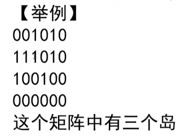 

3. **问题分析**

   感染过程，遇到一个1，然后调用感染过程，将所有与它相连的都变为2。每调用一次感染过程就相当于找到一个岛。

4. **代码实现**

   ```java
   	public static int countsIsland(int[][] island) {
           if (island == null || island[0] == null) {
               return 0;
           }
           int m = island.length;
           int n = island[0].length;
           int res = 0;
           for (int i = 0; i < m; i++) {
               for (int j = 0; j < n; j++) {
                   if (island[i][j] == 1) {
                       res++;
                       infect(island, i, j, m, n);
                   }
               }
           }
           return res;
       }
   
       private static void infect(int[][] island, int i, int j, int m, int n) {
           if (i < 0 || i >= m || j < 0 || j >= n || island[i][j] != 1) {
               return;
           }
           island[i][j] = 2;
           infect(island, i + 1, j, m, n);
           infect(island, i - 1, j, m, n);
           infect(island, i, j + 1, m, n);
           infect(island, i, j - 1, m, n);
       }
   ```

5. **设计一个并行算法解决这个问题**

   > 上面这种是单核`cpu`的解决方案，若矩阵很大，如何多线程解决问题

   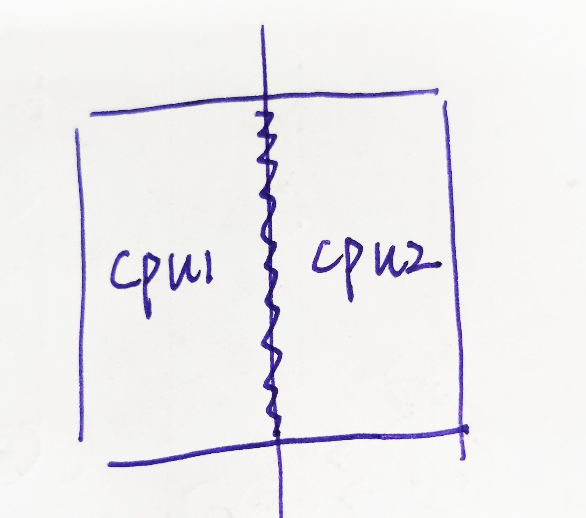

   划分两个区域，每个`cpu`单独处理一个区域，然后再来一个cpu处理边界部分

   #### 并查集

   功能：

   ​	查询两个元素是否在同一个集合中（`isSameSet`）

   ​	将两个元素所在的集合并在一起（`union`）

   ​	然后让两个操作的时间复杂度都变为O(1)

   1. **`isSameSet`**

      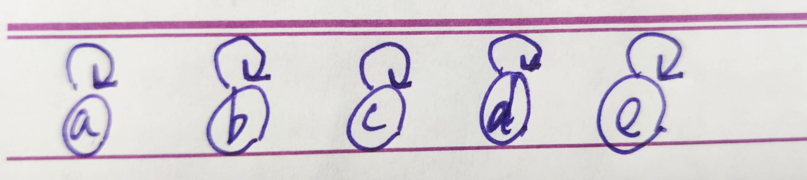

      ​	每个元素都有一个指针，指向它自己上面的元素，如果两个元素的最上面的元素不相同，那么不在一个集合里面，否则就在一个集合里面。

   2. **`union`**

      先调用`isSameSet`查看是否在一个集合里面，如果在则不用union了。

      若不在一个集合里面，那么比较这两个集合里面元素的数量，将少元素的集合的头，链接在多的元素的集合的头后面

      > 注意是头后面，不是最后一个元素后面

      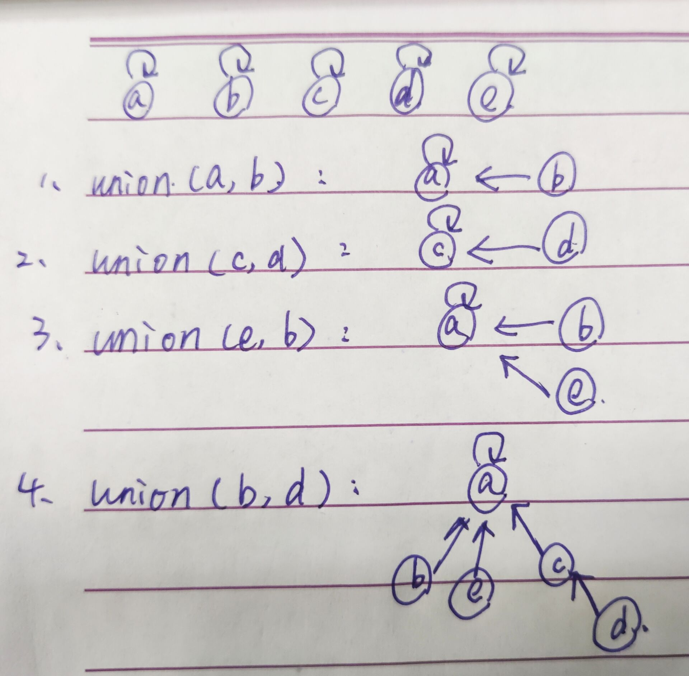
   
   3. **代码实现**
   
      ```java
      public class UnionFind {
          public static class Element<V> {
              private V value;
      
              public Element(V v) {
                  this.value = v;
              }
          }
      
          public static class UnionSet<V> {
              public HashMap<V, Element<V>> elementMap;
              public HashMap<Element<V>, Element<V>> fatherMap;
              public HashMap<Element<V>, Integer> sizeMap;
      
              public UnionSet(List<V> list) {
                  this.elementMap = new HashMap<>();
                  this.fatherMap = new HashMap<>();
                  this.sizeMap = new HashMap<>();
                  for (V value : list) {
                      Element<V> element = new Element<>(value);
                      elementMap.put(value, element);
                      fatherMap.put(element, element);
                      sizeMap.put(element, 1);
                  }
              }
      
              private Element<V> findHead(Element<V> element) {
                  Stack<Element<V>> stack = new Stack<>();
                  while (fatherMap.get(element) != element) {
                      stack.push(element);
                      element = fatherMap.get(element);
                  }
                  while (!stack.isEmpty()) {
                      fatherMap.put(stack.pop(), element);
                  }
                  return element;
              }
      
              public boolean isSameSet(V a, V b) {
                  if (elementMap.containsKey(a) && elementMap.containsKey(b)) {
                      return findHead(elementMap.get(a)) == findHead(elementMap.get(b));
                  }
                  return false;
              }
      
              public void union(V a, V b) {
                  if (elementMap.containsKey(a) && elementMap.containsKey(b)) {
                      Element<V> e1 = elementMap.get(a);
                      Element<V> e2 = elementMap.get(b);
                      Element<V> head1 = findHead(e1);
                      Element<V> head2 = findHead(e2);
                      if (head1 != head2) {
                          Element<V> bigHead = sizeMap.get(head1) > sizeMap.get(head2) ? head1 : head2;
                          Element<V> smallHead = bigHead == head1 ? head2 : head1;
                          fatherMap.put(smallHead, bigHead);
                          sizeMap.put(bigHead, sizeMap.get(bigHead) + sizeMap.get(smallHead));
                          sizeMap.remove(smallHead);
                      }
                  }
              }
          }
      }
      ```

      >    在找代表节点的时候，经过一个优化操作。把从链底的所有所有元素依次入栈，然后在找到头的时候，再把所有的栈里的元素，链接到头下面。
      >
      >    这样就可以使每个元素到头元素的距离最短。因为`union`与`isSameSet`的操作都是找头，那么若头到该元素的距离很短，时间就会很短。

      假设现N个样本，若`findHead`的调用次数达到了O(N)水平，那么单次`findHead`的平均代价为O(1)，即`findHead`调用次数越多，平均复杂度越低。

      > O(f(N)) 当N -> N^80(宇宙原子量)时，这个函数返回不超过6
   
   
   
   #### `KMP`
   
   > 该算法是找到一个字符串`str1`中是否包含另一个字符串`str2`，若包含，则返回`str2`在`str1`中的位置，否则返回-1
   
   1. **`NEXT`数组**
   
      ​	该数组是针对`str2`（即待查字串）设计的。数组中的每一个元素，对应`str2`相应位置的前面所有字符串的，最大前缀和后缀相等的长度，例如：
   
      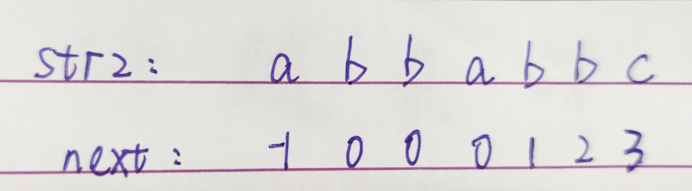
   
      
   
   > 这里`next[]`数组中，每个字符对应的值都和自己没关系，之和它的前面的字符串有关。数组的第一个值与第二个值规定为-1和0
   >
   > 而且，前缀和后缀可能出现交叉的情况，但是其长度不能和前面的字符串的总长度相同。
   
   2. **算法流程**
   
      * **传统算法**
   
        暴力遍历，从`str1`的每个字符开始，判断从该字符往后是否和`str2`相同
   
      * **`KMP`算法**
   
        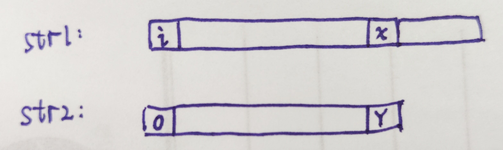
   
        假设现在`str1`的 i 位置和`str2`相比较，直到比到`str1`为 x ，`str2`为 y 才发现两个字符串不相同。那么说明`str1`与`str2`在x，y之前都是相同的。
   
        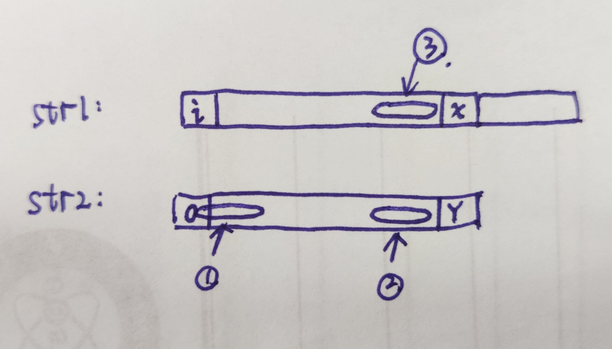
   
        现在根据`str2`的next数组，找到 y 前面的最大前缀和后缀相等的长度。假设 y 前面的字符串中，最长前缀为圈1，最长后缀为圈2，然后圈2对应在`str1`中的位置为圈3，所以有`圈1 = 圈2 = 圈3`
   
        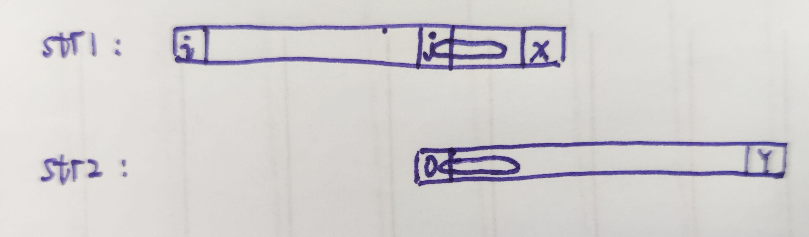
   
        设`str1`中圈3的第一个位置为 j ，因为圈3等于圈1，那么从 j 到 x 就等于`str2`从0开始的最长前缀。把`str2`往后移，让`str2`的0位置，与`str1`的 j 位置对齐，那么画圈的部分就是相同的，就不用比了，直接从圈后面的字符开始比较即可。
   
        > 但是还需要证明：`str1`的 i 到 j 之间，没有能与`str2`相匹配的首字符。
   
      * **证明`str1`的 i 到 j 之间，没有能与`str2`相匹配的首字符**
   
        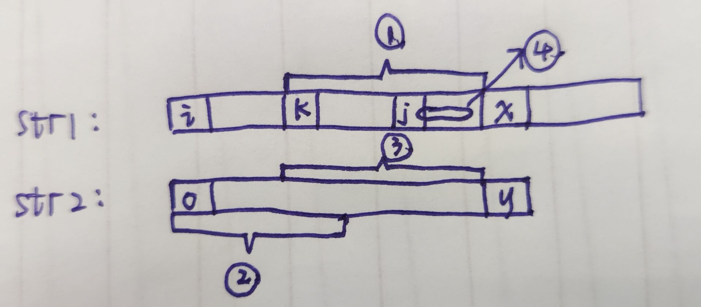
        
        ​	现在已知，圈4是`str2`在y位置前的最长后缀，最长后缀的开始字符位置为 j ，从`str1`的 i 位置开始直到 x 的前一个字符，与`str2`都是匹配的。
        
        ​	假设现在存在 i 到 j 中有一个位置 k ，从 k 位置开始可以与`str2`相匹配，那么就有圈1等于圈2。
        
        ​	因为从`str1`的 i 位置开始直到 x 的前一个字符，与`str2`都是匹配的，所以圈1等于圈3，所以圈3等于圈2，那么最长的前缀后缀字符串就变为了圈2与圈3，大于圈4的长度，所以不对，所以不存在位置k。
        
        **证得！**
        
      * **实例**
      
        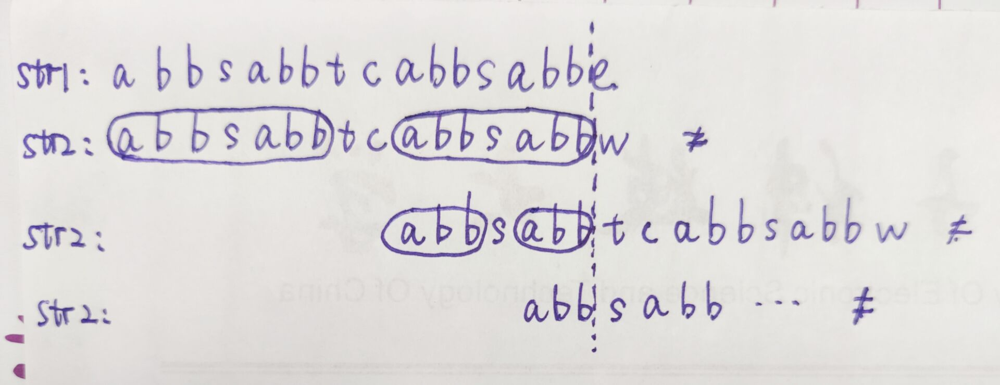
      
        现有字符串`str1`与`str2`， 在当前位置比较到 e 和 w 的时候发现两个字符串不同，前面都相同
      
        通过`next[]`数组找`str2`中 w 前面的最长前后缀，然后移动`str2`，让最长前缀与最长后缀对齐，比较 e 与 t 以及后面，发现不相同。
      
        然后再找`str2`中 t 前面的最长前后缀，再移动`str2`让前缀与后缀对齐，再比较 s 与 e 以及后面的，发现还不相同。
      
        然后 s 前面的最长前后缀长度为0，所以`str1`中往后移动，寻找一个新的位置，再与`str2`的头位置比较。
      
      * **`KMP`代码逻辑**
      
        1. 获取`str2`的`next[]`数组。
      
        2. 定义两个指针`i1 i2`分别指向`str1 str2`的第一个位置。
      
        3. 如果`i1 i2`对应的字符串相等，`i1++ i2++`
      
        4. 如果不等，而且`i2`不是`str2`的首位置，说明已经有相同的部分了，但是这个位置不相同。所以让`str2`移动，使前缀与后缀对齐，开始比较前缀的后一个字符，即`i2 = next[i2]`
      
           > 因为下标是从0开始的
      
        5. 如果发现是首位置的话，那么说明`str1`的这个位置与`str2`的首位置就不同了，所以`i1++`
      
        6. 当`i1或者i2`越界的时候，终止循环，若`i2`越界，说明找到了，返回`i1-i2`；若`i1`越界，说明没找到，返回-1。
      
      * **`KMP`代码实现**
      
        ```java
        	public static int getIndex(String s, String m) {
                if (s == null || m == null || m.length() == 0 || s.length() < m.length()) {
                    return -1;
                }
                char[] str1 = s.toCharArray();
                char[] str2 = m.toCharArray();
                int[] next = getNextArr(str2);
                int i1 = 0, i2 = 0;
                while (i1 < str1.length && i2 < str2.length) {
                    if (str1[i1] == str2[i2]) {
                        i1++;
                        i2++;
                    } else if (i2 == 0) {
                        i1++;
                    } else {
                        i2 = next[i2];
                    }
                }
                return i2 >= str2.length ? i1 - i2 : -1;
            }
        ```
      
      * **`next[]`数组实现逻辑**
      
        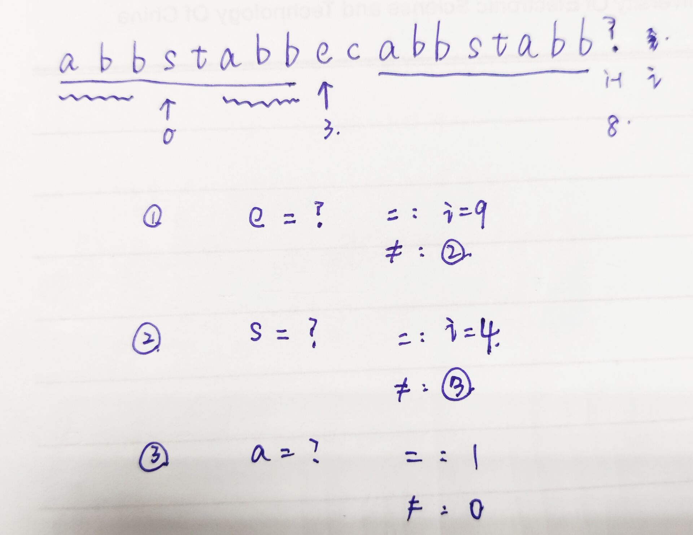
      
        * 首先初始0位置为-1，1位置为0。
      
        * 计算第i个位置的值，先看`i-1`位置的值为多少。如图所示，`i-1`位置的值为8，那么就寻找next数组下标为8的地方
      
          > i-1下标为8说明0-7上是最长前缀，长度为8，下标为8位置就是最长前缀的下一个位置。
      
            ，即 e 是否等于`str2`在`i-1`位置的字符`?`
      
        * 若相等，则 i 位置为8+1=9
      
        * 若不相等，则看e位置上的值，为3，看`str2`在3的位置上的 s 是否等于 ？，相等则 i为3+1=4
      
        * 发现不相等，则看0，若0位置和？相等返回1，否则返回0
      
        > 因为i-1前面的最长后缀和最长前缀是一样的，所以最长前缀这整个字符串的最长后缀，就等于最长后缀这整个字符串的最长后缀，即`abb = abb`，i-1的最长前缀中的最长前缀`abb`，等于i-1的最长前缀中的最长后缀，所以i-1的最长前缀中的最长前缀`abb`，等于i-1的最长后缀中的最长后缀`abb`，所以可以接着判断e是否与？相等。
      
      * **`next[]`数组代码逻辑**
      
        1. 若数组长度为1，则返回-1数组
      
        2. 规定0位置为-1，1位置为0
      
        3. 定义变量`cn`，为当前处理到的位置 i 的前面的最长前后缀长度，那么在初始化的时候就设为0，i设为2
      
           > `cn`代表两个含义：
           >
           > 1. 当前处理到的位置 i 的前面的最长前后缀长度
           > 2. 当前i-1位置的字符串应该和比较的位置
           >
           > （按比对位置来理解的话比较好理解）
      
        4. 当 i-1 位置的字符和`cn`位置的字符相等时，i位置的值等于i-1位置的值+1，然后当前位置的信息处理完毕，`i++，cn++`
      
           > 那么下一个处理的字符前面的最长前后缀长度就是`cn+1`，所以`cn++`
           >
           > 或者下一个比对的字符的位置为`cn+1`
      
        5. 当 i-1 位置的字符和`cn`位置的字符不相等时，看`cn`能不能往前跳，即`cn`是否为0，即最长前后缀长度是否为0，或者比对的位置是否为0
      
        6. 如果不为0的话，说明现在这个比对位置的前面还有与圈4相等的圈1，那么`cn = next[cn]`
      
           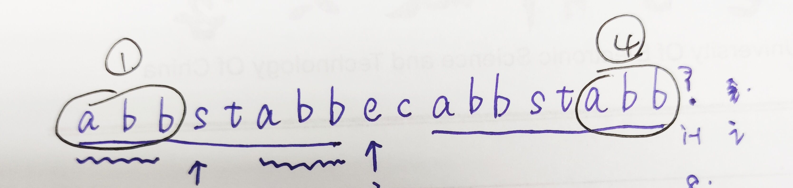
      
        7. 如果为0的话，说明已经不能再往前跳了，该位置就是0了
      
           > 不要这样想：`cn`为0说明对比位置为0，那么如果0位置和 i-1 位置的字符相等，该值还能为1呢。
           >
           > 因为这种情况已经被第一个if捕获了，根本不会进到这层逻辑里面。
      
      * **`next[]`数组代码实现**
      
      ```java
      	private static int[] getNextArr(char[] str2) {
              if (str2.length == 1) {
                  return new int[]{-1};
              }
              int[] next = new int[str2.length];
              int i = 2;
              int cn = 0;
              while (i < next.length) {
                  if (str2[i - 1] == str2[cn]) {
                      next[i++] = ++cn;
                  } else if (cn > 0) {
                      cn = next[cn];
                  } else {
                      next[i++] = 0;
                  }
              }
              return next;
          }
      ```
      
      **时间复杂度O(N)，`str1`的长度N**
   