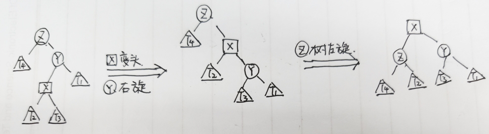

## 平衡二叉树`BST`

1. **查询**

   根据性质查询即可

2. **删除**

   * **删除叶子节点**

     

     删除2，让1的右指针置空

   * **删除单子女节点**

     

     删除4，让3指向5

   * **删除儿女双全节点**

     

     删除3节点，让左树的最右孩子或者右树的最左孩子替换自己，例如选择让圈4替换圈3，让圈6的左指针指向圈4的右边部分A

     （因为圈4已经右树的最左节点了，所以圈4没有左孩子了），然后让圈4替换圈3

     ----------

     

#### 搜索二叉树与`SizeBalanceTree`与`AVL`树与红黑树关系

> SB、AVL、红黑树都属于BST，只不过每种树的平衡性调整方法不一样

* **左旋**

  整棵树向左倒

  

* **右旋**

  整棵树向右倒

  

  > 怎么旋就是往哪儿倒，可以通过左旋与右旋调整数的平衡性

#### `AVL`树的检查时机

1. **插入节点**

   

   插入节点X，那么从X依次向上检查，以该节点为头的树是不是满足平衡性

2. **删除节点**

   

   删除节点5，用6替换5（右子树的最左节点），然后从7开始查平衡性，7，8，然后到头6

#### 四种类型判断

1. **LL型**

   左树的左边长，右旋

2. **RR型**

   右树的右边长，左旋

3. **LR型**

   左树的右边长

   

6. **RL型**

   

> RR型与LL型转一次，RL型与LR型转两次

#### SB树

1. **平衡性**

   每棵子树的大小，不小于其兄弟的子树的大小，即每棵叔叔树的大小，不小于其任何侄子树的大小

> 即 [B] >= MAX{[F], [G]} [C] >= MAX{[D], [E]}