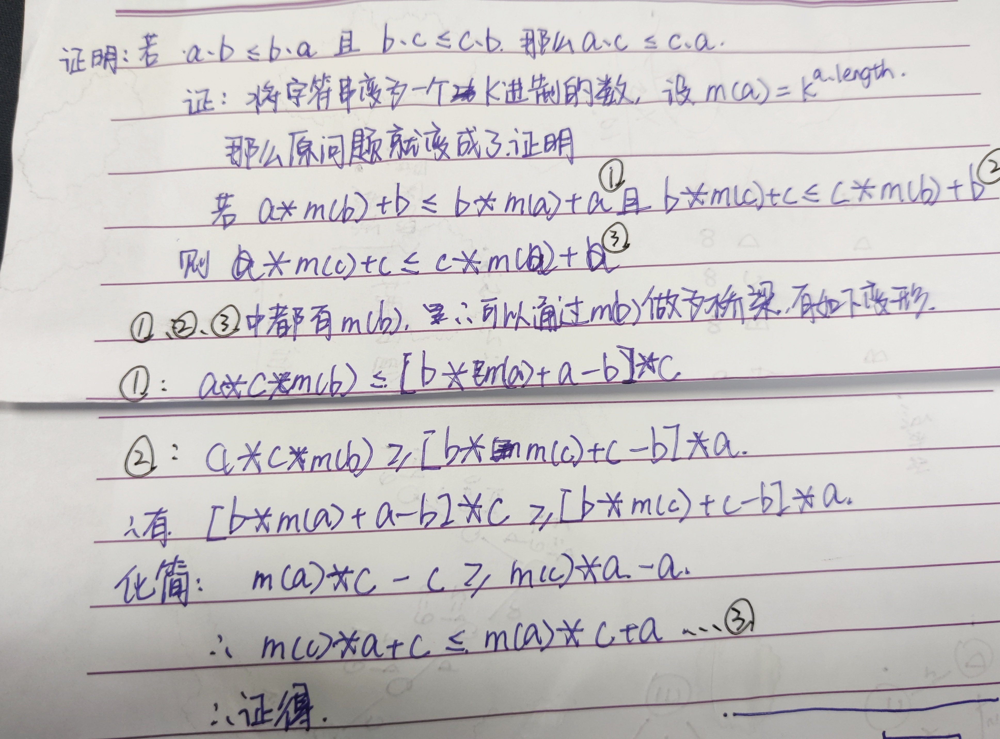
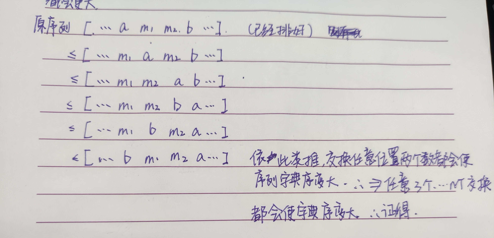
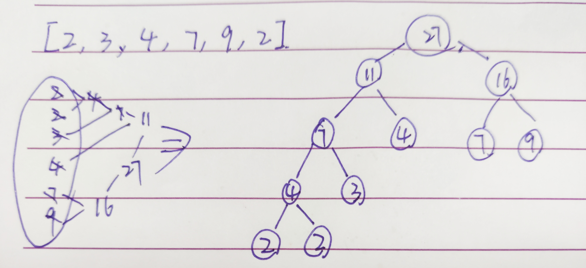
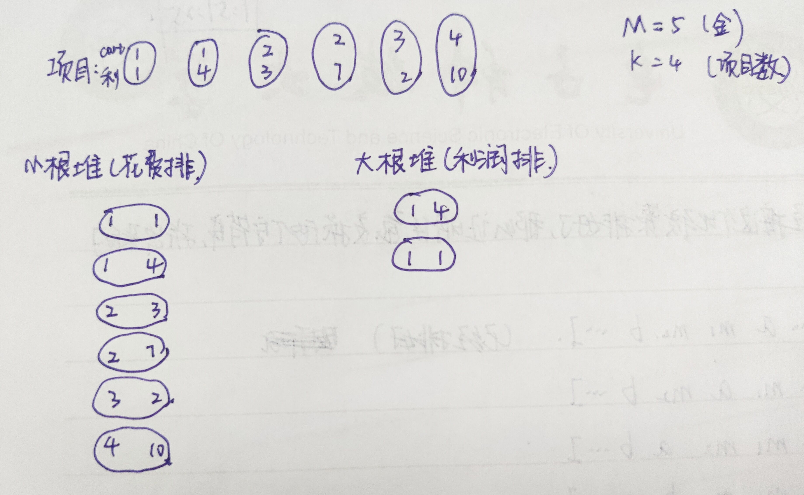

## 贪心算法

> ​	贪心策略和自然智慧十分相似。寻找贪心策略，带一点直觉和技巧，不要过分的去纠结为什么这个策略是成立的，否则考场上时间来不及。

> 1. 实现一个不依靠贪心的解法X，可以暴力（因为是暴力所以时间应该过不了）
> 2. 脑补出不同的贪心策略A B C
> 3. 用解法X和对数器，验证每一个贪心策略，用实验的方式去得知哪个正确
> 4. 不要纠结贪心策略的证明

* **会议安排问题**

  1. **问题描述**

     给定一个会议数组，和会议室的开门时间，安排出最多的会议

  2. **流程**

     ​	按照会议的结束时间对会议数组进行排序，然后遍历数组。初始化现在的时间`timePoint`为会议室的开始时间。判断当前数组中的元素的开始时间是否小于`timePoint`，如果小于的话，说明时间不允许，删除，跳到下一个会议。若这个会议时间可以，那么把`timePoint`设置为当前会议的结束之间。

     ​	遍历直到最后一个会议。

  3. **代码实现**

     ```java
     	public static int bestArrange(Program[] programs, int timePoint) {
             if (programs == null || programs.length == 0) {
                 return 0;
             }
             Arrays.sort(programs, Comparator.comparingInt(a -> a.endTime));
             int res = 0;
             for (int i = 0; i < programs.length; i++) {
                 if (programs[i].startTime >= timePoint) {
                     res++;
                     timePoint = programs[i].endTime;
                 }
             }
             return res;
         }
     ```

* **最小字典序**

  1. **问题描述**

     给定一个字符串数组，要求将所有字符串拼接起来，获得最小的字典序

     > **字典序**：理解成字典里的顺序，先出现的字典序就小

  2. **贪心策略**

     两个字符串，a和b，如果`ab <= ba`那么a放前，否则b放前，然后将这个字符串数组从前到后拼接起来

     即对数组使用这个比较器：`(a,b) -> (a+b).compareTo(b+a)`

     > ​	要使自己的贪心策略是一个有效的贪心策略，比如说：甲和乙相遇，甲放前；乙和丙相遇，乙放前；甲和丙相遇，丙放前。这样的策略就是无效的，不满足传递性。
     >
     > ​	现在要使自己的贪心策略满足传递性。

  3.  **证明传递性**

     即证明：若`a.b <=  b.a && b.c <= c.b`那么`a.c <= c.a`

     > '.'是指把两个字符串拼接在一起

     **证明：**

     ​	将字符串定义为K进制的数，那么`"abc"."de" = "abc" * k ^ 2`，由此，把字符串的拼接运算变为了数字运算。

     ​	所以`a.b = a * k ^ b.length + b`

     ​	所以原来的证明问题就变成了：`a*k^b.length+b <= b*k^a.length+a && b*k^c.length+c <= c*k^b.length+b`那么`a*k^c.length+c <= c*k^a.length+a`

     

  4. **证明序列最小性**

     

  5. **结论**

     贪心算法证明很复杂，靠经验和规律来寻找贪心策略

  6. **代码实现**

     ```java
     	public static String findMin(String[] strings) {
             if (strings == null || strings.length == 0) {
                 return "";
             }
             Arrays.sort(strings, (a, b) -> (a + b).compareTo(b + a));
             StringBuilder sb = new StringBuilder();
             for (String str : strings) {
                 sb.append(str);
             }
             return sb.toString();
         }
     ```

* **切金条问题**

  1. **问题描述**

     一群人分一块金条，切x长度的金条需要用x个铜板，求怎么分会花费最少。

     > 比如长度为60的金条，，三个人分别想要10，20，30。
     >
     > 1. 60先分为50和10，需要60，50分为30和20，需要50，一共110
     > 2. 60先分为30和30，需要60，30分为10和20，需要30，一共90

  2. **思路**

     

     * 把这个数组放入小根堆。

     * 取出两个最小的数，把他们的和再放入小根堆。

     * 依次类推直到小根堆里面只有一个数。

       > 哈夫曼树

  3. **代码实现**

     ```JAVA
      	public static int getMinPrice(int[] arr){
             if(arr == null || arr.length == 0){
                 return 0;
             }
             PriorityQueue<Integer> queue = new PriorityQueue<>(Comparator.comparing(a-> a));
             for(int i:arr){
                 queue.add(i);
             }
             int sum = 0;
             while(queue.size() >1){
                 int a = queue.poll();
                 int b = queue.poll();
                 sum += a+b;
                 queue.add(a+b);
             }
             return sum;
         }
     ```

* **项目最大利润** 

  1. **问题描述**

     给定一些项目，每个项目有花费和利润两条数据，并且给定总资金和最多参与的项目数量，求最大利润

     > 可以做完一个项目，拿着所有的钱去做第二个项目，然后参与的总项目数不能超过规定

  2. **流程分析**

     

     * 首先按照项目花费来排序，所有项目进入小根堆
     * 然后选择自己能做的起的项目，再按照利润排序进入大根堆
     * 选取大根堆最大的项目做，更新资本，从小根堆里面再找
     * 直到到达能做的最大项目数

  3. **代码实现**

     ```java
     	public static class Project {
             public int cost;
             public int profit;
     
             public Project(int cost, int profit) {
                 this.cost = cost;
                 this.profit = profit;
             }
         }
     
         public static int getMaxProfit(Project[] projects, int money, int maxNum) {
             PriorityQueue<Project> costMinQueue = new PriorityQueue<>(Comparator.comparingInt(a -> a.cost));
             PriorityQueue<Project> profitMaxQueue = new PriorityQueue<>((a, b) -> b.profit - a.profit);
             costMinQueue.addAll(Arrays.asList(projects));
             int allMoney = money;
             Project cp = null;
             while (maxNum > 0) {
                 while (!costMinQueue.isEmpty() && costMinQueue.peek().cost <= allMoney) {
                     profitMaxQueue.add(costMinQueue.poll());
                 }
                 if (profitMaxQueue.isEmpty()) {
                     return allMoney - money;
                 }
                 allMoney += profitMaxQueue.poll().profit;
                 maxNum--;
             }
             return allMoney - money;
         }
     ```

* **随时获得一个数据流的中位数**（不是贪心算法）

  1. **流程**

     * 定义一个大根堆和一个小根堆，首先放一个数到大根堆里面。然后处理第二个数。
     * 如果这个数比大根堆的堆顶大，那么把这个数放到小根堆里面。
     * 放入一个数之后，比较两个堆的size，如果一个堆的size比另一个大2了，那么就把大的那个的堆poll一个放到另一个里面
     * 然后看两个堆的大小，如果两个size相同，取两个堆顶的平均数，如果size差一，中位数就是大的堆顶

     > 大根堆小根堆的调整都是logN级别的

  2. **代码实现**

     ```java
     	public static double getMedian(double[] nums) {
             if (nums.length == 1) {
                 return nums[0];
             }
             PriorityQueue<Double> minQueue = new PriorityQueue<>(Comparator.comparingDouble(a -> a));
             PriorityQueue<Double> maxQueue = new PriorityQueue<Double>((a, b) -> b > a ? 1 : -1);
             maxQueue.add(nums[0]);
             for (int i = 1; i < nums.length; i++) {
                 if (nums[i] > maxQueue.peek()) {
                     minQueue.add(nums[i]);
                 } else {
                     maxQueue.add(nums[i]);
                 }
                 int diff = minQueue.size() - maxQueue.size();
                 if (Math.abs(diff) == 2) {
                     if (diff > 0) {
                         maxQueue.add(minQueue.poll());
                     } else {
                         minQueue.add(maxQueue.poll());
                     }
                 }
             }
             if (minQueue.size() == maxQueue.size()) {
                 return ((minQueue.peek() + maxQueue.peek())) / 2;
             }
             return minQueue.size() > maxQueue.size() ? minQueue.peek() : maxQueue.peek();
         }
     ```

     

     

     ​                                                                                                                                                                                                                                                                                                                                                                                                                                                                                                                                                                                                                                                                                                                                                                                                                                                                                                                                                                                                                                                                                                                                                                                                                                                                                                                                                                                                                                                                                                                                                                                                                                                                                                                                                                                                                                                                                                                                                                                                                                                                                                                                                                                                                                                                                                                                      

  