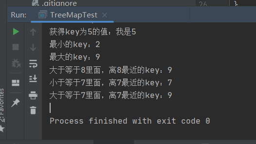
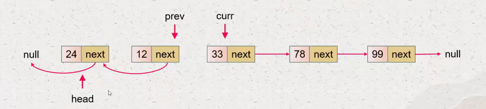
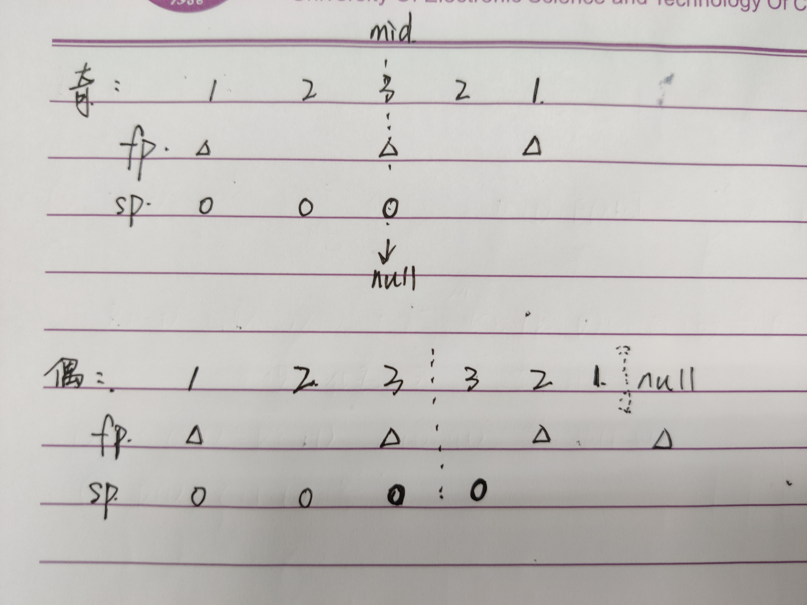
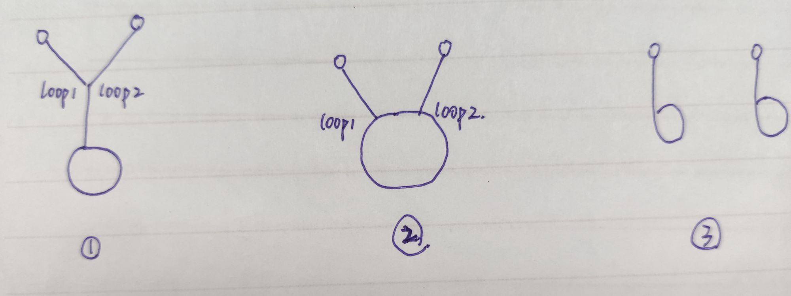
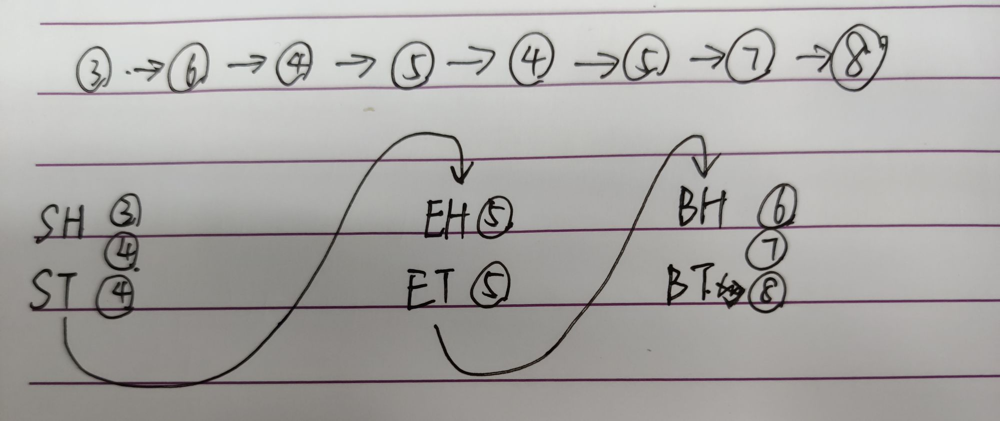
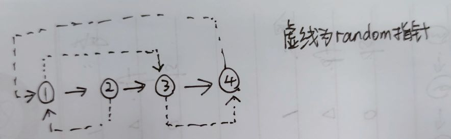
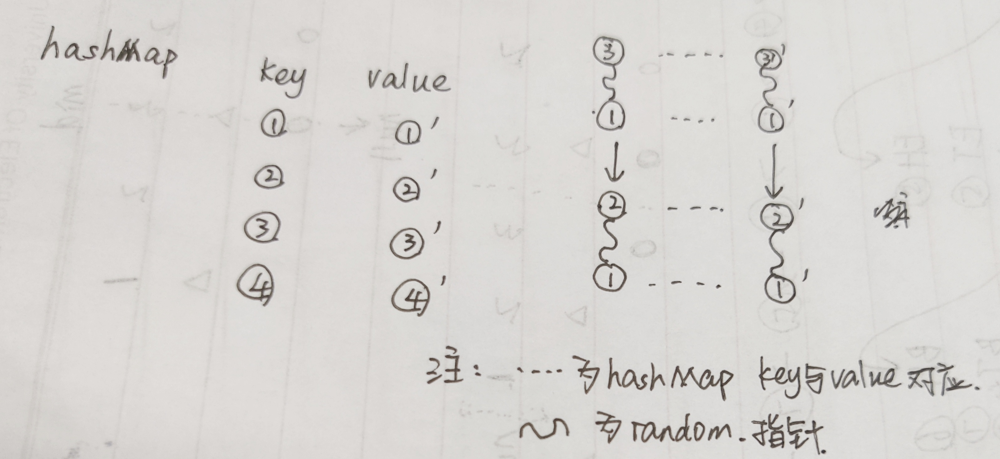
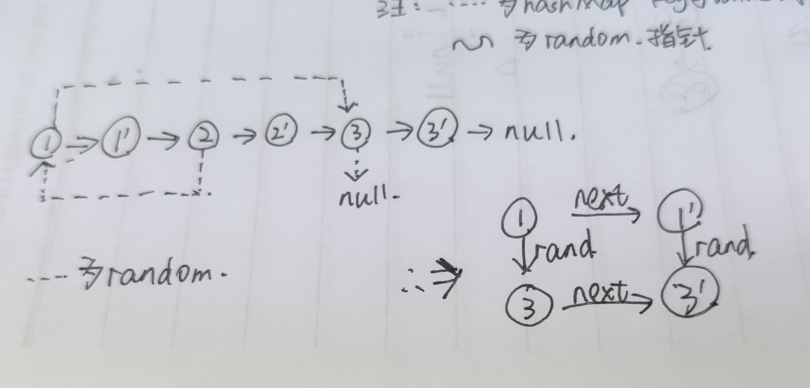
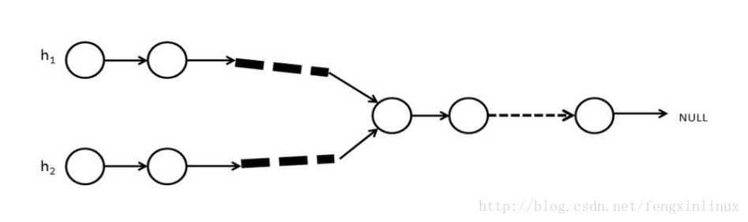

### TreeMap

* **实例代码**

  ```java
  public static void main(String[] args) {
          //只有key就是treeSet结构，既有key又有value就是treeMap结构
          //treeMap中格局key来有序组织，有序表必须要求我们的key是可以比较的
          TreeMap<Integer, String> treeMap1 = new TreeMap<>();
          treeMap1.put(7, "我是7");
          treeMap1.put(5, "我是5");
          treeMap1.put(4, "我是4");
          treeMap1.put(3, "我是3");
          treeMap1.put(9, "我是9");
          treeMap1.put(2, "我是2");
          System.out.println("是否包含key为5的内容：" + treeMap1.containsKey(5));
          System.out.println("获得key为5的值：" + treeMap1.get(5));
          System.out.println("最小的key：" + treeMap1.firstKey());
          System.out.println("最大的key：" + treeMap1.lastKey());
          System.out.println("大于等于8里面，离8最近的key：" + treeMap1.ceilingKey(8));
          System.out.println("小于等于7里面，离7最近的key：" + treeMap1.floorKey(7));
          System.out.println("大于等于7里面，离7最近的key：" + treeMap1.ceilingKey(8));
          //删除key为5对应的节点
          treeMap1.remove(5);
      }
  ```

  

  

> 如果key不能比较，要自己提供比较器，eg.

```java
TreeMap<Node, String> treeMap2 = new TreeMap<>((a, b) -> a.value - b.value);
```

### 单向链表

* **反转单项链表**

  

  ```java
  	public static ListNode reverseList(ListNode head) {
          ListNode prev = null;
          ListNode curr = head;
          while (curr != null) {
              ListNode next = curr.next;
              curr.next = prev;
              prev = curr;
              curr = next;
          }
          return prev;
      }
  ```

* **打印两个有序列表的公共部分**

  > 要求时间O(N)，空间O(1)

  1. **思路**

     两个指针分别指向两个头部，比较两个指针对应的值，谁小谁移动，相同的时候打印，打印完成后共同移动，直到有一方停下。

  2. **代码实现**

     ```java
     	public static void printListCommonPart(ListNode l1, ListNode l2) {
             ListNode c1 = l1, c2 = l2;
             while (c1 != null && c2 != null) {
                 if (c1.value < c2.value) {
                     c1 = c1.next;
                 } else if (c1.value > c2.value) {
                     c2 = c2.next;
                 } else {
                     System.out.print(c1.value + "\t");
                     c1 = c1.next;
                     c2 = c2.next;
                 }
             }
         }
     ```

* **快慢指针**

  > 注意快慢指针的边界问题。比如，链表长度为偶数，快指针走完时，要求慢指针走到中点的前一个还是后一个\

  -----

  #### 判断是否为回文链表

  1. 压栈出栈方法（笔试，快写出来就好）

     ```java
     	public static boolean isListPalindrome_stack(ListNode head) {
             Stack<ListNode> stack = new Stack<>();
             ListNode temp = head;
             while (temp != null) {
                 stack.push(temp);
                 temp = temp.next;
             }
             temp = head;
             while (!stack.empty()) {
                 if (stack.pop().value != temp.value) {
                     return false;
                 }
                 temp = temp.next;
             }
             return true;
         }
     ```

     > 这里可以不用再声明一个flag的布尔值变量

  2. 空间复杂度O(1)的办法

     ```java
     	public static boolean isListPalindrome(ListNode head) {
             if (head == null || head.next == null) {
                 return true;
             }
             ListNode fp = head, sp = head;
             ListNode mid = null;
             while (fp != null && fp.next != null) {
                 fp = fp.next.next;
                 sp = sp.next;
             }
             mid = sp;
             ListNode tail = reserveList(mid);
             ListNode l1 = head, l2 = tail;
             boolean flag = true;
             while (l1 != null && l2 != null) {
                 if (l1.value != l2.value) {
                     flag = false;
                     break;
                 }
                 l1 = l1.next;
                 l2 = l2.next;
             }
             reserveList(tail);
             return flag;
         }
     
     	private static ListNode reserveList(ListNode head) {
             ListNode prev = null;
             ListNode curr = head;
             while (curr != null) {
                 ListNode temp = curr.next;
                 curr.next = prev;
                 prev = curr;
                 curr = temp;
             }
             return prev;
         }
     ```

     

     >  如图，快慢指针移动的循环条件为（fp != null && fp.next != null），此时sp到达的位置作为mid。
     
     #### 单链表环问题
     
     1. **问题描述**
     
        判断一个单链表有没有环，有则返回入环的第一个节点，没有则返回null
     
        > 注意，不会有类似蝴蝶结一样的形状，因为链表的next只会指向一个节点，只要相交后面就会重合
     
     2. **套路&流程**
     
        定义快慢指针，快指针移动2，慢指针移动1
     
        无环则快指针会移动到null，有环的话快慢指针会相遇
     
        相遇后快指针回到head，和慢指针一起一个一个动，相遇后就是入换点
     
        > 这个规律记下来即可
     
     3. **代码实现**
     
        ```java
        	public static ListNode listCircle(ListNode head) {
                ListNode fp = head, sp = head;
                while (fp.next != null && fp.next.next != null) {
                    fp = fp.next.next;
                    sp = sp.next;
                    if (fp == sp) {
                        break;
                    }
                }
                if (fp.next == null || fp.next.next == null) {
                    return null;
                }
                fp = head;
                while (fp != sp) {
                    fp = fp.next;
                    sp = sp.next;
                }
                return fp;
            }
        ```

####  可能有环的两个单链表相交

1. **问题描述**

   给两个链表，这两个链表可能有环可能无环，相交返回第一个节点，不相交返回null

2. **情况讨论**

   * 两个链表都无环，就是上面那个问题

   * 一个有环，一个无环，不相交

   * 两个都有环，有三种情况，如下图所示

     

     loop1 == loop2：情况一

     loop1 != loop2：让loop1循环一圈，到自己结束，遇到loop2则情况2，相交，返回谁都行；如果没遇到，那就是情况3

3. **代码实现**

   ```java
   	public static ListNode findNode(ListNode l1, ListNode l2) {
           if (l1 == null || l2 == null) {
               return null;
           }
           ListNode loop1 = findLoopNode(l1);
           ListNode loop2 = findLoopNode(l2);
           if (loop1 == null && loop2 == null) {
               return findNodeWithoutLoop(l1, l2);
           }
           if (loop1 == null || loop2 == null) {
               return null;
           }
           if (loop1 == loop2) {
               return loop1;
           }
           ListNode ct = loop1.next;
           while (ct != loop1) {
               if (ct == loop2) {
                   return ct;
               }
               ct = ct.next;
           }
           return null;
       }
   
       private static ListNode findLoopNode(ListNode head) {
           if (head == null || head.next == null) {
               return null;
           }
           ListNode fp = head, sp = head;
           while (fp.next != null && fp.next.next != null) {
               fp = fp.next.next;
               sp = sp.next;
               if (fp == sp) {
                   break;
               }
           }
           if (fp.next == null || fp.next.next == null) {
               return null;
           }
           fp = head;
           while (fp != sp) {
               fp = fp.next;
               sp = sp.next;
           }
           return fp;
       }
   
       private static ListNode findNodeWithoutLoop(ListNode l1, ListNode l2) {
           ListNode p1 = l1, p2 = l2;
           int len1 = 1, len2 = 1;
           while (p1.next != null) {
               len1++;
               p1 = p1.next;
           }
           while (p2.next != null) {
               len2++;
               p2 = p2.next;
           }
           if (p1 != p2) {
               return null;
           }
           int diff = len1 - len2;
           p1 = l1;
           p2 = l2;
           if (diff > 0) {
               //l1比l2长
               for (int i = 0; i < diff; i++) {
                   p1 = p1.next;
               }
           } else if (diff < 0) {
               for (int i = 0; i < -diff; i++) {
                   p2 = p2.next;
               }
           }
           while (p1 != p2) {
               p1 = p1.next;
               p2 = p2.next;
           }
           return p1;
       }
   ```

* **单链表partition**

  1. **问题描述**

     排序一个链表，给一个数，使得链表左边小于它，中间等于它，右边大于它

  2. **思路**

     声明六个变量，分别为小于部分的头和尾、等于部分的头和尾、大于部分的头和尾。头等于null的时候往头里插，并且尾等于头，不等于null的时候，插到尾后面，然后尾后移。最后尾首相连。

     

  3. **代码实现**

     ```java
      	public static ListNode listPartition(ListNode head, int flag) {
             ListNode SH = null, ST = null;
             ListNode EH = null, ET = null;
             ListNode BH = null, BT = null;
             ListNode temp = head;
             while (temp != null) {
                 //节点值小于flag
                 if (temp.value < flag) {
                     if (SH == null) {
                         SH = temp;
                         ST = temp;
                     } else {
                         ST.next = temp;
                         ST = ST.next;
                     }
                 } else if (temp.value == flag) {
                     //节点值等于flag
                     if (EH == null) {
                         EH = temp;
                         ET = temp;
                     } else {
                         ET.next = temp;
                         ET = ET.next;
                     }
                 } else {
                     if (BH == null) {
                         BH = temp;
                         BT = temp;
                     } else {
                         BT.next = temp;
                         BT = BT.next;
                     }
                 }
                 temp = temp.next;
             }
             if (SH != null) {
                 if (EH != null) {
                     ST.next = EH;
                     ET.next = BH;
                 } else {
                     ST.next = BH;
                 }
                 return SH;
             } else if (EH != null) {
                 ET.next = BH;
                 return EH;
             }
             return BH;
         }
     ```

     > 要注意一下各个区域是否存在的问题

* **复制一个含有random指针的单链表**

  1. **问题描述**，复制一个如下图的链表

     

  2. **思路**

     * 使用hashmap，需要额外空间复杂度

       

       **代码实现**

       ```java
       	public static ListNode copyListWithRandom(ListNode head) {
               HashMap<ListNode, ListNode> map = new HashMap<>();
               ListNode cur = head;
               while (cur != null) {
                   map.put(cur, new ListNode(cur.value));
                   cur = cur.next;
               }
               cur = head;
               while (cur != null) {
                   map.get(cur).next = map.get(cur.next);
                   map.get(cur).pre = map.get(cur.pre);
                   cur = cur.next;
               }
               return map.get(head);
           }
       ```

       > 在这里对于新表中的所有节点，不用建立新的索引与其对应，直接用hashMap里面的值相对应即可

     * 不使用hashMap

       

       ```java
       	public static ListNode copyListWithRandom_2(ListNode head) {
               ListNode curr = head;
               ListNode next = null;
               while (curr != null) {
                   next = curr.next;
                   curr.next = new ListNode(curr.value);
                   curr.next.next = next;
                   curr = next;
               }
               curr = head;
               ListNode curCopy = null;
               //只关心random指针
               while (curr != null) {
                   next = curr.next.next;
                   curCopy = curr.next;
                   curCopy.pre = curr.pre == null ? null : curr.pre.next;
                   curr = next;
               }
               ListNode res = head.next;
               curr = head;
               while (curr != null) {
                   next = curr.next.next;
                   curCopy = curr.next;
                   curCopy.next = next == null ? null : next.next;
                   curr.next = next;
                   curr = next;
               }
               return res;
           }
       ```

* **两个单链表相交问题**

  #### 无环单链表相交

  1. **问题描述**

     给两个无环链表，可能相交也可能不相交，相交返回第一个节点，不相交返回null

  2. **思路**

     若两个链表相交，那么从交点开始，所有节点就重合了，所以最后一个节点一定相同。

     

     遍历到尾部，同时计数每个链表有多少个节点，判断两个尾部节点是否相同，相同则相交，否则不相交，返回null

     然后计算出节点数量差，再次遍历一遍即可

  3. **代码实现**

     ```java
     	public static ListNode findNode(ListNode l1, ListNode l2) {
             if (l1 == null || l2 == null) {
                 return null;
             }
             int n1 = 1, n2 = 1;
             ListNode t1 = l1, t2 = l2;
             while (t1.next != null) {
                 n1++;
                 t1 = t1.next;
             }
             while (t2.next != null) {
                 n2++;
                 t2 = t2.next;
             }
             if (t1 != t2) {
                 return null;
             }
             int diff = n1 - n2;
             t1 = l1;
             t2 = l2;
             if (diff > 0) {//l1长，让l1先遍历
                 for (int i = 0; i < diff; i++) {
                     t1 = t1.next;
                 }
             } else {
                 for (int i = 0; i < -diff; i++) {
                     t2 = t2.next;
                 }
             }
             while (t1 != t2) {
                 t1 = t1.next;
                 t2 = t2.next;
             }
             return t1;
         }
     ```

### 双向链表

* 反转双向链表

  ```java
  	public static ListNode reverseShuangxiangList(ListNode head) {
          ListNode cur = head;
          ListNode pre = null;
          ListNode temp = null;
          while (cur != null) {
              temp = cur.next;
              cur.next = pre;
              cur.pre = temp;
              pre = cur;
              cur = temp;
          }
          return pre;
      }
  ```

  